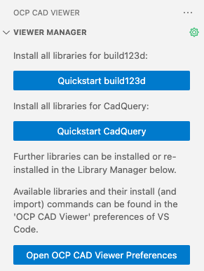
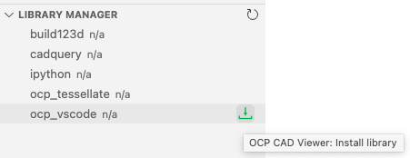
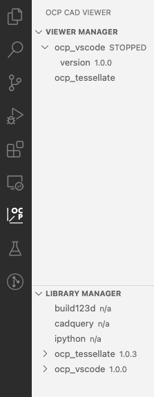
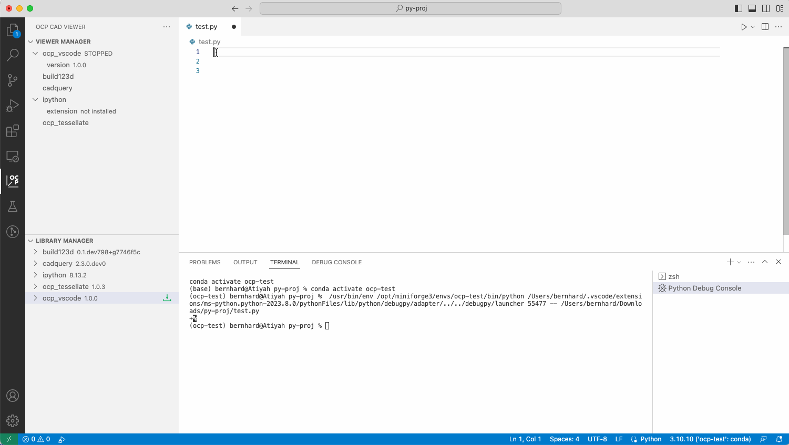

# OCP CAD Viewer for VS Code

_OCP CAD Viewer for VS Code_ is an extension to show [CadQuery](https://github.com/cadquery/cadquery) and [build123d](https://github.com/gumyr/build123d) objects in VS Code via [three-cad-viewer](https://github.com/bernhard-42/three-cad-viewer)

## Installation

**Prerequisites**

-   A fairly recent version of VS Code, e.g. 1.76.0 or newer
-   [Python extension](https://marketplace.visualstudio.com/items?itemName=ms-python.python) installed in VS Code
-   `Python` and `pip` available in the Python enviroment that will be used for CAD development (with `conda` the minimum is `conda create -n ocp python=3.9`)

**Steps**:

-   Open the VS Code Marketplace, and search and install OCP CAD Viewer 1.0.0. 

    Afterwards the OCP viewer is available in the VS Code sidebar:
    
    

-   Install `ocp_vscode` via the blue button in the welcome screen of the "Viewer Manager" or by pressing the green down-arrow in the "Library Manager" section of the OCP CAD Viewer sidebar

    

    Afterwards, the "Viewer Manager" and the "Library Manager" show the loaded libraries:

    

-   Additionally, you can use the OCP CAD Viewer sidebar to manage the Python libraries for *build123d*, *cadquery*, *ipython* and *ocp_tessellate*
    -   Install the needed library by pressing the green down-arrow behind the library name in the "Library Manager" section of the OCP CAD Viewer sidebar

    More details, see [here](./docs/install.md)

## Usage

### Using with VS Code Run menu

-   Start the OCP CAD Viewer by pressing the green box-arrow button in the "Viewer Manager" section of the OCP CAD Viewer sidebar
-   Import ocp_vscode and the CAD library by using the paste button behing the library names in the "Viewer Manager" section
-   Use the usual Run menu to run the code

Extra topics

- [Use the ipython extension](docs/ipython.md)
- [Use the `show` command](docs/show.md)
- [Use the `show_object` command](docs/show_object.md)
- [Download examples for build123d or cadquery](docs/examples.md)
- [Use the build123d snippets](docs/snippets.md)

