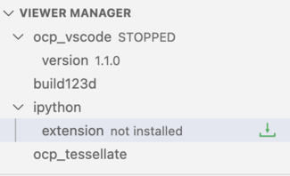

# _OCP CAD Viewer_ for VS Code

_OCP CAD Viewer_ for VS Code is an extension to show [CadQuery](https://github.com/cadquery/cadquery) and [build123d](https://github.com/gumyr/build123d) objects in VS Code via the[three-cad-viewer](https://github.com/bernhard-42/three-cad-viewer) viewer component.

## Setup

**Prerequisites**

-   A fairly recent version of Microsoft VS Code, e.g. 1.76.0 or newer
-   [Python extension](https://marketplace.visualstudio.com/items?itemName=ms-python.python) installed in VS Code
-   `Python` and `pip` available in the Python enviroment that will be used for CAD development

Notes:

-   For VSCodium, the extension is not available in the marketplace. You need to download the the vsix file from the [release folder](https://github.com/bernhard-42/vscode-ocp-cad-viewer/releases) and install it manually.
-   Currently, on a Silicon Mac (ARM CPU M1 or newer), _OCP_ and _CadQuery_ can only be installed via `conda` and Python 3.10. Prepare an environment with `conda create -n code_cad python=3.10`.

**Installation**:

Open the VS Code Marketplace, and search and install _OCP CAD Viewer_ 1.1.0. Afterwards the OCP viewer is available in the VS Code sidebar. Clicking on it shows:

You have 3 choices:

-   Prepare _OCP CAD Viewer_ for working with [build123d](https://github.com/gumyr/build123d): Presse the _Quickstart build123d_ button.

    This will install _OCP_, _build123d_, _ipython_, _ocp_tessellate_ and _ocp_vscode_ via `pip` (except for Apple Silicon machnes that require `conda`)

    

-   Prepare _OCP CAD Viewer_ for working with [CadQuery](https://github.com/cadquery/cadquery): Presse the _Quickstart CadQuery_ button.

    This will install _OCP_, _CadQuery_, _ipython_, _ocp_tessellate_ and _ocp_vscode_ via `pip` (except for Apple Silicon machnes that require `conda`)

    

-   Ignore the quick starts and use the "Library Manager" to install the libraries. Doing so, _OCP CAD Viewer_ let's you select whether to use `pip`, `conda` or `poetry`. Install the needed library by pressing the green down-arrow behind the library name in the "Library Manager" section of the _OCP CAD Viewer_ sidebar. For more details, see [here](./docs/install.md)

It is highly recommended to work with ipython and the extionsion. To install the ipython extension, press the green arrow after the ipython entry in the "Viewer Manager":

## Usage

### Using with VS Code Run menu

-   Start the _OCP CAD Viewer_ by pressing the green box-arrow button in the "Viewer Manager" section of the _OCP CAD Viewer_ sidebar
-   Import ocp_vscode and the CAD library by using the paste button behing the library names in the "Viewer Manager" section
-   Use the usual Run menu to run the code

### Library Manager

You can also use "Library Manager" in the _OCP CAD Viewer_ sidebar to manage the Python libraries for _build123d_, _cadquery_, _ipython_ and _ocp_tessellate_ (Presse the green arrow whenhovering over a library to install/upgrade it)

### Extra topics

-   [Use the ipython extension](docs/ipython.md)
-   [Use the `show` command](docs/show.md)
-   [Use the `show_object` command](docs/show_object.md)
-   [Download examples for build123d or cadquery](docs/examples.md)
-   [Use the build123d snippets](docs/snippets.md)
