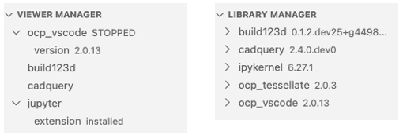
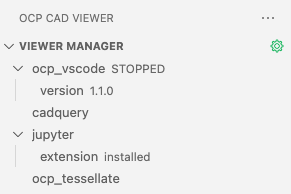
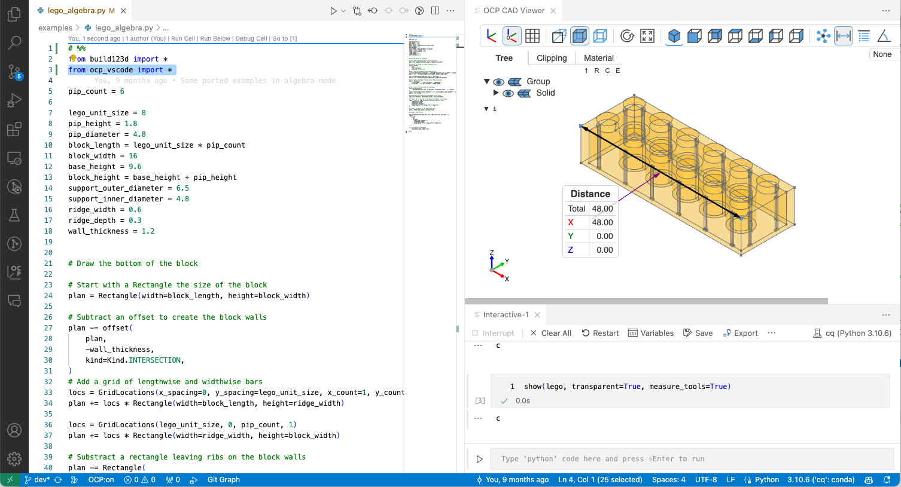
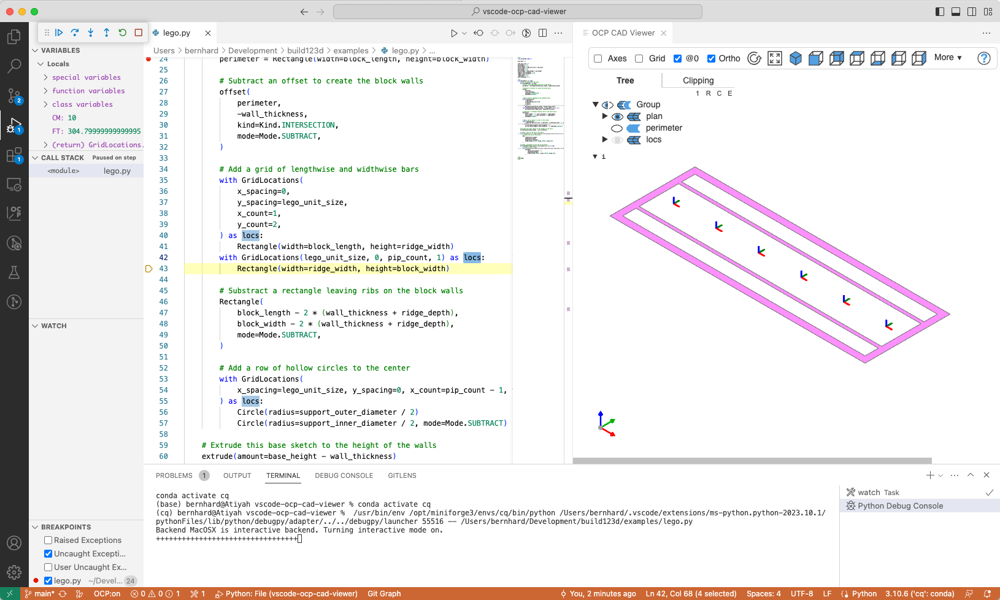

# _OCP CAD Viewer_ for VS Code

_OCP CAD Viewer_ for VS Code is an extension to show [CadQuery](https://github.com/cadquery/cadquery) and [build123d](https://github.com/gumyr/build123d) objects in VS Code via the [three-cad-viewer](https://github.com/bernhard-42/three-cad-viewer) viewer component.

## Installation

### Prerequisites

-   A fairly recent version of Microsoft VS Code, e.g. 1.84.0 or newer
-   The [Python extension](https://marketplace.visualstudio.com/items?itemName=ms-python.python) installed in VS Code
-   Necessary tools:
    -   `python` and `pip` available in the Python enviroment that will be used for CAD development
    -   The command `git` needs to be available
    -   On a Silicon Apple computer the command `mamba` needs to be available. You might want to consider using [Mambaforge](https://github.com/conda-forge/miniforge#mambaforge).

**Notes**:

-   To use OCP CAD Viewer, start VS Code from the commandline in the Python environment you want to use or select the right Python interpreter in VS Code first. **OCP CAD Viewer depends on VS Code using the right Python interpreter** (i.e. mamba / conda / pyenv / poetry / ... environment).
-   For VSCodium, the extension is not available in the VS code market place. You need to download the the vsix file from the [release folder](https://github.com/bernhard-42/vscode-ocp-cad-viewer/releases) and install it manually.
-   Currently, on a Silicon Mac (ARM CPU), _OCP_ and _CadQuery_ can only be installed via `mamba` and Python 3.9 or 3.10. Prepare an environment with `mamba create -n code_cad python=3.9` or `mamba create -n code_cad python=3.10`.

### Installation

1. Open the VS Code Marketplace, and search and install _OCP CAD Viewer 2.0.6_.

    Afterwards the OCP viewer is available in the VS Code sidebar:

    

2. Clicking on it shows the OCP CAD Viewer UI:

    

    You have 3 options:

    - Prepare _OCP CAD Viewer_ for working with [build123d](https://github.com/gumyr/build123d): Presse the _Quickstart build123d_ button.

        This will install _OCP_, _build123d_, _ipykernel_ (_jupyter_client_), _ocp_tessellate_ and _ocp_vscode_ via `pip` (except for Apple Silicon machines that require `mamba`)

        

    - Prepare _OCP CAD Viewer_ for working with [CadQuery](https://github.com/cadquery/cadquery): Presse the _Quickstart CadQuery_ button.

        This will install _OCP_, _CadQuery_, _ipykernel_ (_jupyter_client_), _ocp_tessellate_ and _ocp_vscode_ via `pip` (except for Apple Silicon machines that require `mamba`)

        

    - Ignore the quick starts and use the "Library Manager" to install the libraries. Doing so, _OCP CAD Viewer_ let's you select whether to use `pip`, `mamba`, `conda` or `poetry`. Install the needed library by pressing the green down-arrow behind the library name in the "Library Manager" section of the _OCP CAD Viewer_ sidebar. For more details, see [here](./docs/install.md)

    The Quickstarts will also

    - (optionally) install the the [Jupyter extension for VS Code from Microsoft](https://marketplace.visualstudio.com/items?itemName=ms-toolsai.jupyter)
    - start the OCP viewer
    - create a demo file in a temporary folder to quickly see a simple usage example

## Usage

### Running code using Jupyter

-   Start the _OCP CAD Viewer_ by pressing the green box-arrow button in the "Viewer Manager" section of the _OCP CAD Viewer_ sidebar
-   Import ocp_vscode and the CAD library by using the paste button behing the library names in the "Viewer Manager" section
-   Use the usual Run menu to run the code



### Debugging code with visual debugging

After each step, the debugger checks all variables in `locals()` for being CAD objects and displays them with their variable name.
Note:

-   Check that `OCP:on` is visible in the status bar
-   It also shows planes, locations and axis, so name your contexts
-   It remembers camera position and unselected variables in the tree
-   during debugging, `show` and `show_object` are disabled. They interfere with the visual debugging



### Library Manager

You can also use "Library Manager" in the _OCP CAD Viewer_ sidebar to manage the Python libraries for _build123d_, _cadquery_, _ipython_ and _ocp_tessellate_ (Presse the green arrow whenhovering over a library to install/upgrade it)

### Extra topics

-   [Quickstart experience on Windows](docs/quickstart.md)
-   [Use Jupyter to execute code](docs/run.md)
-   [Debug code with visual debugging](docs/debug.md)
-   [Use the `show` command](docs/show.md)
-   [Use the `show_object` command](docs/show_object.md)
-   [Download examples for build123d or cadquery](docs/examples.md)
-   [Use the build123d snippets](docs/snippets.md)

## Best practices

-   Use the **Jupyter extension** for a more interactive experience. This allows to have one cell (separated by `# %%`) at the beginning to import all libraries

    ```python
    # %%
    from build123d import *
    from ocp_vscode import *

    # %%
    b = Box(1,2,3)
    show(b)
    # %%
    ```

    and then only execute the code in the cell you are currently working on repeatedly.

-   The **config system** of OCP CAD Viewer

    There are 3 levels:

    -   Workspace configuration (part of the VS Code settings, you can access them e.g. via the green gear symbol in OCP CAD Viewer's "Viewer Manager")
    -   Defaults set with the command `set_defaults` per Python file
    -   Parameters in `show` or `show_object` per command

    `set_defaults` overrides the Workspace settings and parameters in `show` and `show_config` override the other two.

    Note that not all parameters are available in the global Workspace config, since they don't make sense globally (e.g. `helper_scale` which depends on the size of the boundary box of the currently shown object)

    A common setup would be

    ```python
    # %%
    from build123d import *
    import cadquery as cq

    from ocp_vscode import *
    set_port(3939)

    set_defaults(reset_camera=False, helper_scale=5)

    # %%
    ...
    ```

    Explanation

    -   The first block imports build123d and CadQuery (omit what you are not interested in).
    -   The second block imports all commands for OCP CAD Viewer. `set_port` is only needed when you have more than one viewer open and can be omitted for the first viewer)
    -   The third block as an example sets helper_scale and reset_camera as defaults. Then every show_object or show command will respect it as the default

-   Debugging build123d with `show_all` and the **visual debugger**

    -   If you name your contexts (including `Location` contexts), the visual debugger will show the CAD objects assigned to the context.

    -   Use `show_all` to show all cad objects in the current scope (`locals()`) of the Python interpreter (btw. the visual debugger uses `show_all` at each step)

        ```python
        # %%
        from build123d import *
        set_defaults(helper_scale=0.5)

        with BuildPart() as bp:
            with PolarLocations(3,8) as locs:
                Box(1,1,1)

        show_all()
        # %%
        ```

        

-   **Keep camera orientation** of an object with `reset_camera`

    Sometimes it is helpful to keep the orientation of an object across code changes. This is what `reset_camera` does:

    -   `reset_camera=Camera.Center` will keep position and rotation, but ignore panning. This means the new object will be repositioned to the center (most robust approach)
    -   `reset_camera=Camera.KEEP` will keep position, rotation and panning. However, panning can be problematic. When the next object to be shown is much larger or smaller and the object before was panned, it can happen that nothing is visible (the new object at the pan location is outside of the viewer frustum). OCP CAD Viewer checks whether the bounding box of an object is 2x smaller or larger than the one of the last shown object. If so, it falls back to `Camera.CENTER`. A notification is written to the OCP CAD Viewer output panel.
    -   `reset_camera=Camera.RESET` will ensure that position, rotation and panning will be reset to the initial default

## Changes

v2.0.6

-   Add three-cad-viewer 2.1.2 to fix black edges issue in measure mode and remove angle tool resizing

v2.0.4

-   Fix regression of ocp-tessallate version

v2.0.3

-   Fix regression in port detection
-   Added missing dependencies for build123d on Apple Silicon

v2.0.2

-   Fix .ocp_vscode detection on Windows
-   Fix showing ShapeList[Vector]
-   Viewer now starts when VS Code opens with a build123d/cadquery Python file

v2.0.1

-   Introduce a workspace configuration `initialPort` for OCP CAD Viewer
-   Change the warning about used port to an auto vanishing info

v2.0.0

-   Introduce **measure mode**. Use `set_defaults(measure_tools=True)` or `show(obj, measure_tools=True)` or the global workspace confiv of OCP CAD Viewer to turn it on. This release added a Python backend process that communicates with the viewer for providing correct BRep measurement info.
-   **Autostart** viewer: When opening or saving a Python file that includes `import cadquery`, `import build123d`, `from cadquery import` or `from build123d import`, the viewer gets started if it is not already running. Use `OcpCadViewer.autostart` configuration of workspace config to turn this feature off.
-   **Environment variable OCP_PORT** is supported. It will be used by the viewer and the `show*` clients as the port for OCP CAD Viewer. This variable can be set on the command line or in `launch.json` (`"env": {"OCP_PORT": "3999"}`).
-   **Modifier keys can now be remapped** `key={"shift": "shiftKey", "ctrl": "ctrlKey", "meta": "metaKey"}`. Valid keys are `shift`, `ctrl` and `meta`. Valid values are `shiftKey`, `ctrlKey`, `metaKey` (command on Mac and Windows on Windows) and `altKey` (option on Mac and Alt on Windows).
-   `CAMERA.KEEP` and `CAMERA.CENTER` now **persist the viewer across execution sessions**. If you want to reset at every beginning, use `show(objs, reset_camer=Camera.RESET)` as the first show command.

full change log see [Changes.md](./Changes.md)
