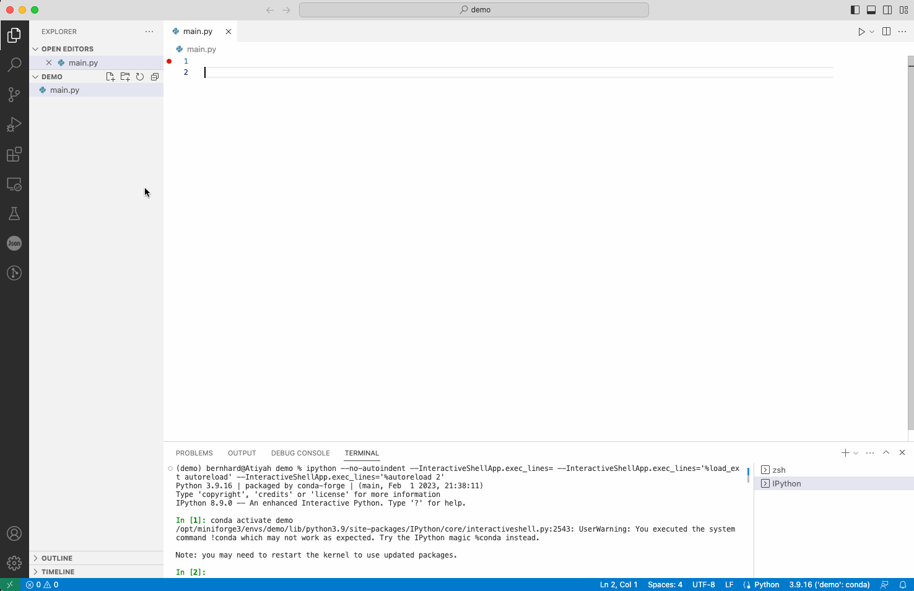
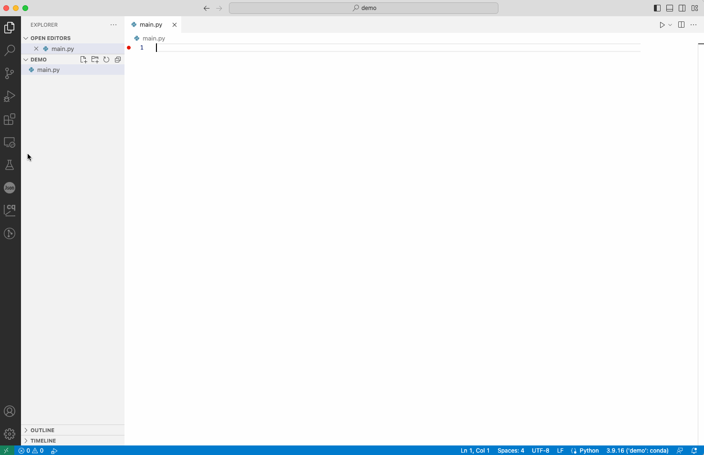
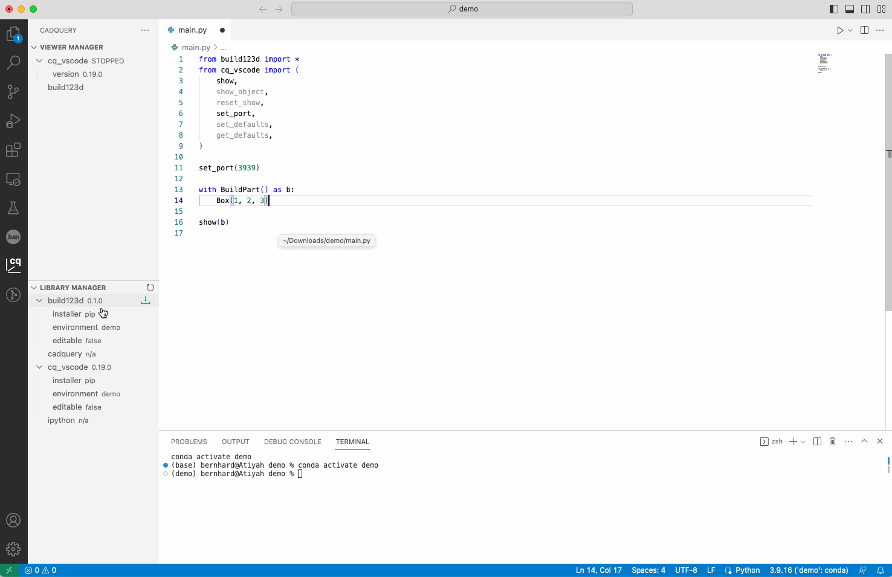
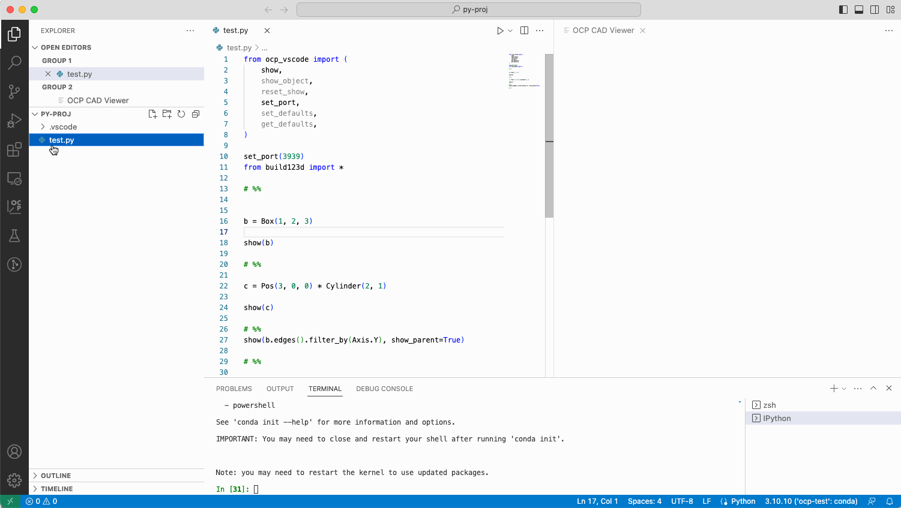
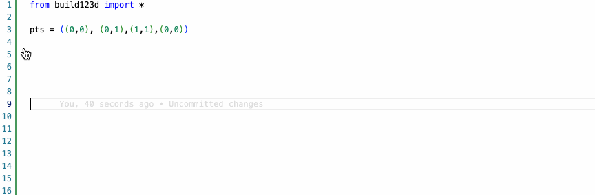

# OCP CAD Viewer for VS Code

_OCP CAD Viewer for VS Code_ is an extension to show [CadQuery](https://github.com/cadquery/cadquery) and [build123d](https://github.com/gumyr/build123d) objects in VS Code via [three-cad-viewer](https://github.com/bernhard-42/three-cad-viewer)

## Installation

**Prerequisites**

-   A fairly recent version of VS Code, e.g. 1.76.0 or newer
-   [Python extension](https://marketplace.visualstudio.com/items?itemName=ms-python.python) installed in VS Code
-   `pip` available in the Python enviroment that will be used for CAD development

**Steps**:

-   Download [ocp-cad-viewer-0.90.0.vsix](https://github.com/bernhard-42/vscode-ocp-cad-viewer/releases/download/v0.90.0/ocp-cad-viewer-0.90.0.vsix)
-   Install it locally in VS Code (_Extensions -> "..." menu -> Install from VSIX..._)
-   Use the OCP CAD Viewer sidebar to manage both OCP CAD Viewer and python libraries:
    -   Install ocp_vscode via the blue button in the welcome screen of the "Viewer Manager" or by pressing the green down-arrow in the "Library Manager" section of the OCP CAD Viewer sidebar
    -   Install needed CAD libraries by pressing the green down-arrow behind the library name in the "Library Manager" section of the OCP CAD Viewer sidebar



## Usage

### Using with VS Code Run menu

-   Start the OCP CAD Viewer by pressing the green box-arrow button in the "Viewer Manager" section of the OCP CAD Viewer sidebar
-   Paste the import code by using the paste button behing the library names in the "Viewer Manager" section
-   Use the usual Run menu to run the code



### Using with IPython extension

-   Install ipython by pressing the green down-arrow behind the "ipython" entry in the "Library Manager" section of the OCP CAD Viewer sidebar
-   Install the IPython extension by pressing the green button behing the "ipython" entry in the "Viewer Manager"
-   Paste the IPyython delimiters by using the paste button behing the "ipython" entry" in the "Viewer Manager" section
-   Use the green run button to run an IPython section



### Downloading examples

-   Go to the Library Manager and find "examples (download)" under an installed library. Note, not all libraries have examples!. Press the green download button
-   Check and modify (if needed) the target download path. Note, a file needs to be open so that the extension can get the working folder
-   The examples will be stored in a folder <library>\_examples, e.g. cadquery_examples



### (Experimental) Install build123d snippets

_OCP CAD Viewer for VS Code_ allows to install a _code-snippets_ file for build123d:

-   Use `Ctrl-Shift-P / Cmd-Shift-P` and select _OCP CAD Viewer: Install CAD snippets into <project>/.vscode/_
-   After typing `b:` a list of snippets appears that guide the user through creation of some basic build123d patterns



## show

```python
show(*cad_objs, names=None, colors=None, alphas=None, port=None, **kwargs):
```

Parameters:

```text
Show CAD objects in Visual Studio Code

Parameters
- cad_objs:          All cad objects that should be shown as positional parameters

Keywords for show:
- names:             List of names for the cad_objs. Needs to have the same length as cad_objs
- colors:            List of colors for the cad_objs. Needs to have the same length as cad_objs
- alphas:            List of alpha values for the cad_objs. Needs to have the same length as cad_objs
- port:              The port the viewer listens to. Typically use 'set_port(port)' instead

Valid keywords to configure the viewer (**kwargs):
- axes:              Show axes (default=False)
- axes0:             Show axes at (0,0,0) (default=False)
- grid:              Show grid (default=False)
- ticks:             Hint for the number of ticks in both directions (default=10)
- ortho:             Use orthographic projections (default=True)
- transparent:       Show objects transparent (default=False)
- default_color:     Default mesh color (default=(232, 176, 36))
- reset_camera:      Reset camera position, rotation and zoom to default (default=True)
- zoom:              Zoom factor of view (default=1.0)
- default_edgecolor: Default mesh color (default=(128, 128, 128))
- render_edges:      Render edges  (default=True)
- render_normals:    Render normals (default=False)
- render_mates:      Render mates (for MAssemblies)
- mate_scale:        Scale of rendered mates (for MAssemblies)
- deviation:         Shapes: Deviation from linear deflection value (default=0.1)
- angular_tolerance: Shapes: Angular deflection in radians for tessellation (default=0.2)
- edge_accuracy:     Edges: Precision of edge discretization (default: mesh quality / 100)
- ambient_intensity  Intensity of ambient ligth (default=1.0)
- direct_intensity   Intensity of direct lights (default=0.12)
```

## show_object

The command support the CQ-Editor parameters `obj`, `name` and `options` plus additional viewer specific args:

```python
show_object(obj, name=None, options=None, port=None, **kwargs)
```

Parameters:

```text
Incrementally show CAD objects in Visual Studio Code

Parameters:
- obj:              The CAD object to be shown

Keywords for show_object:
- name:             The name of the CAD object
- options:          A dict of color and alpha value: {"alpha":0.5, "color": (64, 164, 223)}
                    0 <= alpha <= 1.0 and color is a 3-tuple of values between 0 and 255
- parent:           Add another object, usually the parent of e.g. edges or vertices with alpha=0.25
- clear:            In interactice mode, clear the stack of objects to be shown
                    (typically used for the first object)
- port:             The port the viewer listens to. Typically use 'set_port(port)' instead

Valid keywords to configure the viewer (**kwargs):
- axes:              Show axes (default=False)
- axes0:             Show axes at (0,0,0) (default=False)
- grid:              Show grid (default=False)
- ticks:             Hint for the number of ticks in both directions (default=10)
- ortho:             Use orthographic projections (default=True)
- transparent:       Show objects transparent (default=False)
- default_color:     Default mesh color (default=(232, 176, 36))
- reset_camera:      Reset camera position, rotation and zoom to default (default=True)
- zoom:              Zoom factor of view (default=1.0)
- default_edgecolor: Default mesh color (default=(128, 128, 128))
- render_edges:      Render edges  (default=True)
- render_normals:    Render normals (default=False)
- render_mates:      Render mates (for MAssemblies)
- mate_scale:        Scale of rendered mates (for MAssemblies)
- deviation:         Shapes: Deviation from linear deflection value (default=0.1)
- angular_tolerance: Shapes: Angular deflection in radians for tessellation (default=0.2)
- edge_accuracy:     Edges: Precision of edge discretization (default: mesh quality / 100)
- ambient_intensity  Intensity of ambient ligth (default=1.0)
- direct_intensity   Intensity of direct lights (default=0.12)
```

## Example

```python
import cadquery as cq
from ocp_vscode import show_object, reset_show, set_defaults

reset_show() # use for reapeated shift-enter execution to clean object buffer
set_defaults(axes=True, transparent=False, collapse=1, grid=(True, True, True))

box = cq.Workplane().box(1, 2, 1).edges().chamfer(0.4)
show_object(box, name="box", options={"alpha": 0.5})

sphere = cq.Workplane().sphere(0.6)

show_object(
    sphere,
    # show_object args
    "sphere",
    {"color": (10, 100, 110)},
    # three-cad-viewer args
    collapse="1",
    reset_camera=False,
    ortho=False
)
```
