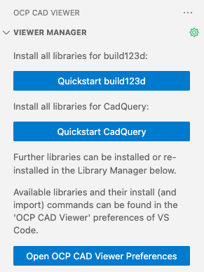
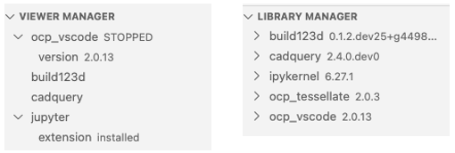
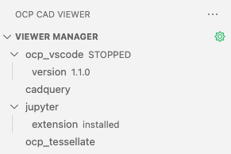
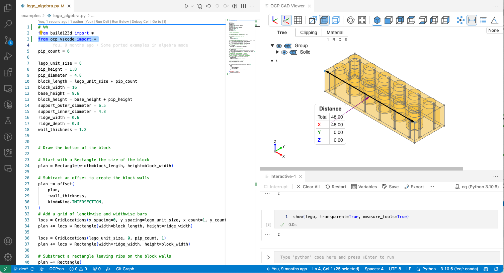
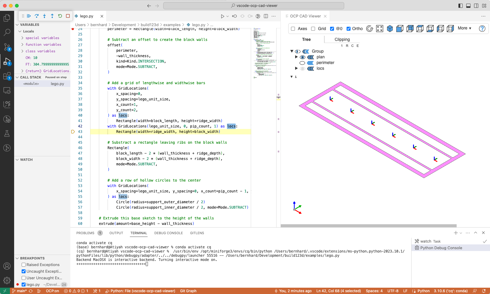
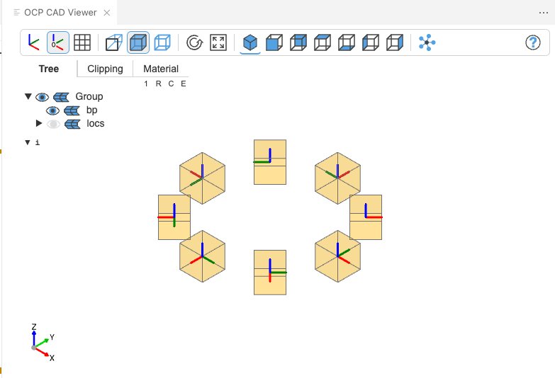

# _OCP CAD Viewer_ for VS Code

_OCP CAD Viewer_ for VS Code is an extension to show [CadQuery](https://github.com/cadquery/cadquery) and [build123d](https://github.com/gumyr/build123d) objects in VS Code via the [three-cad-viewer](https://github.com/bernhard-42/three-cad-viewer) viewer component.

## Installation

### Prerequisites

- A fairly recent version of Microsoft VS Code, e.g. 1.85.0 or newer
- The [Python extension](https://marketplace.visualstudio.com/items?itemName=ms-python.python) installed in VS Code
- Necessary tools:
    - `python` and `pip` available in the Python environment that will be used for CAD development. Note, even when you use another package manager, `pip ` is needed internally and needs to be available.

**Notes**:

- To use OCP CAD Viewer, start VS Code from the commandline in the Python environment you want to use or select the right Python interpreter in VS Code first. **OCP CAD Viewer depends on VS Code using the right Python interpreter** (i.e. mamba / conda / pyenv / poetry / ... environment).
- For VSCodium, the extension is not available in the VS code market place. You need to download the the vsix file from the [release folder](https://github.com/bernhard-42/vscode-ocp-cad-viewer/releases) and install it manually.

### Installation

1. Open the VS Code Marketplace, and search and install _OCP CAD Viewer 3.1.0_.

    Afterwards the OCP viewer is available in the VS Code sidebar:

    

2. Clicking on it shows the OCP CAD Viewer UI with the viewer manager and the library manager:

    

    You have 3 options:
    - Prepare _OCP CAD Viewer_ for working with [build123d](https://github.com/gumyr/build123d): Press the _Quickstart build123d_ button.

        This will install _OCP_, _build123d_, _ipykernel_ (_jupyter_client_), _ocp_tessellate_ and _ocp_vscode_ via `pip`

        

    - Prepare _OCP CAD Viewer_ for working with [CadQuery](https://github.com/cadquery/cadquery): Press the _Quickstart CadQuery_ button.

        This will install _OCP_, _CadQuery_, _ipykernel_ (_jupyter_client_), _ocp_tessellate_ and _ocp_vscode_ via `pip`

        

    - Ignore the quick starts and use the "Library Manager" to install the libraries via `pip` (per default, this can be changed in the VS Code settings). Install the needed library by pressing the down-arrow behind the library name (hover over the library name to see the button) in the "Library Manager" section of the _OCP CAD Viewer_ sidebar. For more details, see [here](./docs/install.md)

    Quickstart will also
    - (optionally) install the the [Jupyter extension for VS Code from Microsoft](https://marketplace.visualstudio.com/items?itemName=ms-toolsai.jupyter)
    - start the OCP viewer
    - create a demo file in a temporary folder to quickly see a simple usage example

**Notes:**

- Do not use the _OCP CAD Viewer_ logo to verify your _OCP CAD Viewer_ settings! The logo overwrites all your settings in VS Code with its own settings to always look the same on each instance. Use a simple own model for checking your configuration

- If you run into issues, see [Troubleshooting](#troubleshooting)

### Install Via CLI

If you aren't using VS Code, you can install/use this extension via command line

Since this is a python extension, it is recommended to install/activate a virtual environment first, (e.g. uv, venv. poetry, conda, pip, etc)

- uv based virtual environemnts:

    ```
    source .venv/bin/activate  # to activate the uv virtual environment
    uv add ocp-vscode
    ```

- pip for other virtual environments:

    ```
    source .venv/bin/activate  # to activate venv virtual environments
    conda / mamba / micromamba activate <env>  # to activate conda like virtual environments
    pip install ocp-vscode
    ```

Note: The extension is in pypi only [pypi](https://pypi.org/project/ocp-vscode/), so for conda, mamba or micromamba environments `pip` or `uv pip` needs to be used.

## Migration from v2.9.0 to v3.0.X

- Change `show` parameter `ticks` to `ticks/2`
- For `joints` together with `render_joints`, instead of

    ```
    +- object_name
       +- shape
       +- joints
          +- joint1
          +- joint2
    ```

    you will find

    ```
    +- object_name
    +- object_name.joints
       +- joint1
       +- joint2
    ```

    Since joints are not under the `object_name` group, they do not animate automatically any more. Use the keyword `animate_joints=True` with `add_track`

- List with unviewable objects only are not shown as empty objects any more but ignored. So possibly less objects will be shown, and you might need to change how you access to these rendered objects.

## Usage

### Running code using Jupyter

- Start the _OCP CAD _ by pressing the box-arrow button in the " Manager" section of the _OCP CAD _ sidebar (hover over the `ocp_vscode` entry to see the button).
- Import ocp_vscode and the CAD library by using the paste button being the library names in the " Manager" section
- Use the usual Run menu to run the code



### Debugging code with visual debugging

After each step, the debugger checks all variables in `locals()` for being CAD objects and displays them with their variable name.
Note:

- Check that `OCP: <port>·DEBUG` is visible in the status bar
- It also shows planes, locations and axis, so name your contexts
- It remembers camera position and unselected variables in the tree
- during debugging, `show` and `show_object` are disabled. They interfere with the visual debugging



### Library Manager

You can also use "Library Manager" in the _OCP CAD _ sidebar to manage the Python libraries for _build123d_, _cadquery_, _ipython_ and _ocp_tessellate_ (Press the down-arrow when hovering over a library name to install/upgrade it)

#### Default pip config for Settings

```json
  "OcpCad.advanced.quickstartCommands": {
    "cadquery": ["{unset_conda} {python} -m pip install ocp_vscode=={ocp_vscode_version} cadquery"],
    "build123d": ["{python} -m pip install ocp_vscode=={ocp_vscode_version} build123d"]
  },
  "OcpCad.advanced.installCommands": {
    "cadquery": ["{unset_conda} {python} -m pip install --upgrade cadquery"],
    "build123d": ["{python} -m pip install --upgrade build123d"],
    "ocp_vscode": ["{python} -m pip install --upgrade ocp_vscode=={ocp_vscode_version}"],
    "ocp_tessellate": ["{python} -m pip install --upgrade ocp_tessellate"],
    "ipykernel": ["{python} -m pip install --upgrade ipykernel"],
    "jupyter_console": ["{python} -m pip install --upgrade jupyter_console"]
  },
```

#### uv config for Settings

```json
  "OcpCad.advanced.quickstartCommands": {
    "cadquery": ["uv add -p {python} ocp_vscode=={ocp_vscode_version} cadquery"],
    "build123d": ["uv add -p {python} ocp_vscode=={ocp_vscode_version} build123d"]
  },
  "OcpCad.advanced.installCommands": {
    "cadquery": ["uv add -p {python} --upgrade cadquery"],
    "build123d": ["uv add -p {python} --upgrade build123d"],
    "ocp_vscode": ["uv add -p {python} --upgrade ocp_vscode=={ocp_vscode_version}"],
    "ocp_tessellate": ["uv add -p {python} --upgrade ocp_tessellate"],
    "ipykernel": ["uv add -p {python} --upgrade ipykernel"],
    "jupyter_console": ["uv add -p {python} --upgrade jupyter_console"]
  }
```

### Extra topics

- [Quickstart experience on Windows](docs/quickstart.md)
- [Use Jupyter to execute code](docs/run.md)
- [Debug code with visual debugging](docs/debug.md)
- [Measure mode](docs/measure.md)
- [Object selection mode](docs/selector.md)
- [Use the `show` command](docs/show.md)
- [Use the `show_object` command](docs/show_object.md)
- [Use the `push_object` and `show_objects` command](docs/push_object.md)
- [Use the `show_all` command](docs/show_all.md)
- [Use the `set__config` command](docs/set__config.md)
- [Download examples for build123d or cadquery](docs/examples.md)
- [Use the build123d snippets](docs/snippets.md)

## Standalone mode

Standalone mode allows to use OCP CAD without VS Code: `python -m ocp_vscode`. This will start a Flask server and the can be reached under `http://127.0.0.1:<port number>` (per default http://127.0.0.1:3939). All client side feature of the VS Code variant (i.e. `show*` features) should be available (including measurement mode) except visual debugging (see above) which relies on VS Code.

Use `python -m ocp_vscode --help` to understand the command line args:

```
Usage: python -m ocp_vscode [OPTIONS]

Options:
  --create_configfile            Create the config file .ocpvscode_standalone in
                                 the home directory
  --host TEXT                    The host to start OCP CAD with
  --port INTEGER                 The port to start OCP CAD with
  --debug                        Show debugging information
  --timeit                       Show timing information
  --tree_width TEXT              OCP CAD  navigation tree width
                                 (default: 240)
  --no_glass                     Do not use glass mode with transparent
                                 navigation tree
  --theme TEXT                   Use theme 'light' or 'dark' (default:
                                 'light')
  --no_tools                     Do not show toolbar
  --tree_width INTEGER           Width of the CAD navigation tree (default:
                                 240)
  --control TEXT                 Use control mode 'orbit'or 'trackball'
  --up TEXT                      Provides up direction, 'Z', 'Y' or 'L'
                                 (legacy) (default: Z)
  --rotate_speed INTEGER         Rotation speed (default: 1)
  --zoom_speed INTEGER           Zoom speed (default: 1)
  --pan_speed INTEGER            Pan speed (default: 1)
  --axes                         Show axes
  --axes0                        Show axes at the origin (0, 0, 0)
  --black_edges                  Show edges in black
  --grid_xy                      Show grid on XY plane
  --grid_yz                      Show grid on YZ plane
  --grid_xz                      Show grid on XZ plane
  --center_grid                  Show grid planes crossing at center of object
                                 or global origin(default: False)
  --collapse INTEGER             leaves: collapse all leaf nodes, all:
                                 collapse all nodes, none: expand all nodes,
                                 root: expand root only (default: leaves)
  --perspective                  Use perspective camera
  --ticks INTEGER                Default number of ticks (default: 5)
  --transparent                  Show objects transparent
  --default_opacity FLOAT        Default opacity for transparent objects
                                 (default: 0.5)
  --explode                      Turn explode mode on
  --angular_tolerance FLOAT      Angular tolerance for tessellation algorithm
                                 (default: 0.2)
  --deviation FLOAT              Deviation of for tessellation algorithm
                                 (default: 0.1)
  --default_color TEXT           Default shape color, CSS3 color names are
                                 allowed (default: #e8b024)
  --default_edgecolor TEXT       Default color of the edges of shapes, CSS3
                                 color names are allowed (default: #707070)
  --default_thickedgecolor TEXT  Default color of lines, CSS3 color names are
                                 allowed (default: MediumOrchid)
  --default_facecolor TEXT       Default color of faces, CSS3 color names are
                                 allowed (default: Violet)
  --default_vertexcolor TEXT     Default color of vertices, CSS3 color names
                                 are allowed (default: MediumOrchid)
  --ambient_intensity INTEGER    Intensity of ambient light (default: 1.00)
  --direct_intensity FLOAT       Intensity of direct light (default: 1.10)
  --metalness FLOAT              Metalness property of material (default:
                                 0.30)
  --roughness FLOAT              Roughness property of material (default:
                                 0.65)
  --help                         Show this message and exit.
```

## Standalone mode with Docker

If you are not using vscode and you prefer to keep the standalone web running separated in a container,
then take a look at [docker-vscode-ocp-cad-](https://github.com/nilcons/docker-vscode-ocp-cad-).

## Best practices

- Use the **Jupyter extension** for a more interactive experience. This allows to have one cell (separated by `# %%`) at the beginning to import all libraries

    ```python
    # %%
    from build123d import *
    from ocp_vscode import *

    # %%
    b = Box(1,2,3)
    show(b)
    # %%
    ```

    and then only execute the code in the cell you are currently working on repeatedly.

- The **config system** of OCP CAD Viewer

    There are 3 levels:
    - Workspace configuration (part of the VS Code settings, you can access them e.g. via the gear symbol in OCP CAD Viewer's "Viewer Manager" when you hover over the label "VIEWER MANAGER" to see the button)
    - Defaults set with the command `set_defaults` per Python file
    - Parameters in `show` or `show_object` per command

    `set_defaults` overrides the Workspace settings and parameters in `show` and `show_config` override the other two.

    Note that not all parameters are available in the global Workspace config, since they don't make sense globally (e.g. `helper_scale` which depends on the size of the boundary box of the currently shown object)

    A common setup would be

    ```python
    # %%
    from build123d import *
    import cadquery as cq

    from ocp_vscode import *
    set_port(3939)

    set_defaults(reset_camera=False, helper_scale=5)

    # %%
    ...
    ```

    Explanation
    - The first block imports build123d and CadQuery (omit what you are not interested in).
    - The second block imports all commands for OCP CAD Viewer. `set_port` is only needed when you have more than one viewer open and can be omitted for the first viewer)
    - The third block as an example sets helper_scale and reset_camera as defaults. Then every show_object or show command will respect it as the default

- Debugging build123d with `show_all` and the **visual debugger**
    - If you name your contexts (including `Location` contexts), the visual debugger will show the CAD objects assigned to the context.

    - Use `show_all` to show all cad objects in the current scope (`locals()`) of the Python interpreter (btw. the visual debugger uses `show_all` at each step)

        ```python
        # %%
        from build123d import *
        set_defaults(helper_scale=1, transparent=True)

        with BuildPart() as bp:
            with PolarLocations(3,8) as locs:
                Box(1,1,1)

        show_all()
        # %%
        ```

        

- **Keep camera orientation** of an object with `reset_camera`

    Sometimes it is helpful to keep the orientation of an object across code changes. This is what `reset_camera` does:
    - `reset_camera=Camera.Center` will keep position and rotation, but ignore panning. This means the new object will be repositioned to the center (most robust approach)
    - `reset_camera=Camera.KEEP` will keep position, rotation and panning. However, panning can be problematic. When the next object to be shown is much larger or smaller and the object before was panned, it can happen that nothing is visible (the new object at the pan location is outside of the viewer frustum). OCP CAD Viewer checks whether the bounding box of an object is 2x smaller or larger than the one of the last shown object. If so, it falls back to `Camera.CENTER`. A notification is written to the OCP CAD Viewer output panel.
    - `reset_camera=Camera.RESET` will ensure that position, rotation and panning will be reset to the initial default

## Development

Testing:

Native tessellator can be set via `NATIVE_TESSELLATOR=1` and Python tessellator via `NATIVE_TESSELLATOR=0`.

When `OCP_VSCODE_PYTEST=1` is set, `show` will not send the tessellated results to the viewer, but return it to the caller for inspection.

A full test cycle consist of:

```bash
NATIVE_TESSELLATOR=0 OCP_VSCODE_PYTEST=1 pytest -v -s tests/
NATIVE_TESSELLATOR=1 OCP_VSCODE_PYTEST=1 pytest -v -s tests/
```

## Troubleshooting

- **Generic ("it doesn't work")**
    1. Confirm that VS Code extension and ocp_vscode have the same version. This can be seen in the OCP CAD Viewer UI. Or alternatively in the Output panel of VS Code:

        ```text
        2025-07-06 14:51:33.418 [info ] extension.check_upgrade: ocp_vscode library version 2.8.6 matches extension version 2.8.6
        ```

    2. Test whether the standalone viewer works, see [Standalone mode](#standalone-mode) (to eliminate VS Code issues)
    3. Open a work folder and not a Python file (to ensure we do not get in Python path problems)
    4. Check the Output panel. Search for:
        - `PythonPath: 'aaa/bbb/python'` **=> right Python environment?**
        - `Server started on port xxxx` (or so) **=> right port? default is 3939**
        - `Starting Websocket server` **=> should not be followed by an error**
        - `OCP Cad Viewer port: xxxx, folder: yyyy zzzz` **=> yyyy should be the right working folder?**
    5. If all looks fine until now, then toggle Developer tools in VS Code and check browser console. Often we see a WebGL error for the browser of VS Code used for the viewer.

- **CAD Models almost always are invisible in the OCP viewer window**

    ```bash
    three-cad-viewer.esm.js:20276 THREE.WebGLProgram: Shader Error 0 - VALIDATE_STATUS false

    Material Name:
    Material Type: LineBasicMaterial

    Program Info Log: Program binary could not be loaded. Binary is not compatible with current driver/hardware combination. Driver build date Mar 19 2024. Please check build information of source that generated the binary.
    Location of variable pc_fragColor conflicts with another variable.
    ```

    VS Code internal browser that renders the viewer component uses a cache for code and other artifacts. This includes WebGL artifacts like compiled shaders. It can happen that e.g. due to a graphic driver update the compiled version in the cache does not fit to the new driver. Then this error message appears.

    **Solution:** [Delete the VS Code browser cache on Linux](https://bobbyhadz.com/blog/vscode-clear-cache) (go to the section for your operating system)

## Changes

## 3.1.0

**Features**

- Viewer UI:
    - New Zebra tool with normal and reflective stripes
    - Added per-object render mode via `modes` parameter (`Render.ALL`, `Render.EDGES`, `Render.FACES`, `Render.NONE`). Deprecate `render_edges` in favor of `modes` ([#114](https://github.com/bernhard-42/vscode-ocp-cad-viewer/issues/114))
    - Based on a completely refactored [tcv-cad-viewer v4](https://github.com/bernhard-42/three-cad-viewer)
        - Adapted to change API of tcv-cad-viewer v4
        - Adapted to the new consistent notification system of three-cad-viewer v4
        - Normalized control speed settings (pan, rotate, zoom) for consistent behavior across orbit and trackball modes.
        - Fixed trackball panning speed to be more responsive
        - Added keyboard shortcuts for toolbar buttons, camera presets, tab navigation, and animation control. Default bindings:
            - Toggle: `a`/`A` axes, `g`/`G` grid, `p` perspective, `t` transparent, `b` blackedges, `x` explode, `L` zscale, `D` distance, `P` properties, `S` select
            - Views: (keypad cross): top: `8`, left: `4`, iso: `5`, right: `6`, bottom: `2`, front: `1`, rear: `3`
            - Reset: `r` resize, `R` reset
            - Tabs: `T` tree, `C` clip, `M` material, `Z` zebra
            - Other: `h` help, `Space` play/pause, `Escape` stop/close-help
    - Measure tool
        - Unified angle computation at closest points via `BRepExtrema`, supporting all edge/face combinations (circles, splines, cylinders, spheres, …) ([#211](https://github.com/bernhard-42/vscode-ocp-cad-viewer/issues/211))
        - Sectioned response format for distance and properties: metadata at top level, grouped data in `result` array
        - Returns direction/normal vectors and context-aware labels (`line`, `face normal`, `tangent at P1`, `surface normal at P2`)
        - Measurement arrows adapt to point proximity: cones flip outward when points are close, and are hidden when coincident — preventing visual overlap
        - Measurement panels now render grouped backend responses with horizontal separators between groups (backend is info master)
    - Refreshed logo to use font Montserrat instead of Futura
- Animation
    - Exposed animation.set_relative_time in 1/1000 steps to contol animation from within Python
    - New feature to save animation as animated gif with fps and loop settings
    - Animation now takes paths from actually shown object tree
    - Animation allows to show additional objects beside the animated assembly (but the paths change!)
- Extension status bar
    - The status bar entry now shows the currently used port (`OCP: 3939·DEBUG` / `OCP: 3939`), is only visible when the viewer is running, and was moved to the right where the Python status items live
- Terminal
    - A new Workspace config `OcpCadViewer.advanced.shellCommandPrefix` allows to exclude commands from shell history for bash, zsh, ... ([#204](https://github.com/bernhard-42/vscode-ocp-cad-viewer/issues/204))
    - The extension respects VS Code's automationProfile and defaultProfile terminal settings when creating terminals
      Order: `automationProfile` (if set), then `defaultProfile` → resolved via profiles (if set) then OS login shell ([#198](https://github.com/bernhard-42/vscode-ocp-cad-viewer/issues/198))
- Python
    - No support for Python 3.9 any more
    - The new default for the `reset_camera` parameter is `Camera.KEEP`. Note:
        - This can be changed in the VS Code settings for "OCP CAD Viewer".
        - It overwrites the "up" setting of the camera
    - Change application order of defaults and UI status: the defaults set by `set_defaults` now take precedence over the viewer's current UI status
    - Upgrade to websockets 16.0 for Python 3.14 and proxy autodetection support ([#210](https://github.com/bernhard-42/vscode-ocp-cad-viewer/issues/210))

**Fixes**

- Removed 'text' wrapper from standalone status command result ([205](https://github.com/bernhard-42/vscode-ocp-cad-viewer/issues/205))
- Setting timeit does not turn debug mode on any more ([#206](https://github.com/bernhard-42/vscode-ocp-cad-viewer/issues/206))
- Tessellator does not strip parent compound any more (when it only has a single child) ([#207](https://github.com/bernhard-42/vscode-ocp-cad-viewer/issues/207))
- Fixed animation for Quaternion based tracks ([#208](https://github.com/bernhard-42/vscode-ocp-cad-viewer/issues/208))
