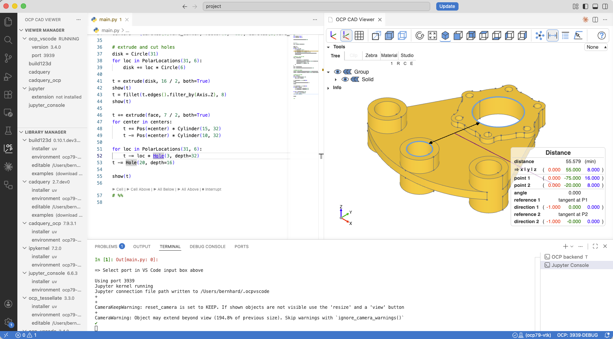

# _OCP CAD Viewer_ for VS Code

_OCP CAD Viewer_ for VS Code is an extension to show [CadQuery](https://github.com/cadquery/cadquery) and [build123d](https://github.com/gumyr/build123d) objects in VS Code via the [three-cad-viewer](https://github.com/bernhard-42/three-cad-viewer) viewer component.



A typical session is just a few lines of Python:

```python
# build123d
from build123d import Box
from ocp_vscode import show

show(Box(1, 2, 3))
```

```python
# CadQuery
import cadquery as cq
from ocp_vscode import show

show(cq.Workplane().box(1, 2, 3))
```

## Installation

### Prerequisites

- Microsoft VS Code, 1.85.0 or newer
- The [Python extension](https://marketplace.visualstudio.com/items?itemName=ms-python.python) installed in VS Code
- Necessary tools: `python` and `pip` or `uv pip`/`uv add` available in the Python environment that will be used for CAD development.

**Notes**:

- To use OCP CAD Viewer, start VS Code from the commandline in the Python environment you want to use or select the right Python interpreter in VS Code first. **OCP CAD Viewer depends on VS Code using the right Python interpreter** (i.e. mamba / conda / pyenv / poetry / ... environment).
- For VSCodium, the extension is not available in the VS code market place. You need to download the the vsix file from the [release folder](https://github.com/bernhard-42/vscode-ocp-cad-viewer/releases) and install it manually.

### Installation within VS Code

1. Open the VS Code Marketplace, and search and install _OCP CAD Viewer 3.4.0_.

    Afterwards the OCP viewer is available in the VS Code sidebar:

    

2. Clicking on it shows the OCP CAD Viewer UI with the viewer manager and the library manager:

    

    You have 3 options:
    - Prepare _OCP CAD Viewer_ for working with [build123d](https://github.com/gumyr/build123d): Press the _Quickstart build123d_ button.

        This will install _OCP_, _build123d_, _ipykernel_ (_jupyter_client_), _ocp_tessellate_ and _ocp_vscode_ via `pip`

        

    - Prepare _OCP CAD Viewer_ for working with [CadQuery](https://github.com/cadquery/cadquery): Press the _Quickstart CadQuery_ button.

        This will install _OCP_, _CadQuery_, _ipykernel_ (_jupyter_client_), _ocp_tessellate_ and _ocp_vscode_ via `pip`

        

    - Ignore the quick starts and use the "Library Manager" to install the libraries via `pip` (per default, this can be changed in the VS Code settings). Install the needed library by pressing the down-arrow behind the library name (hover over the library name to see the button) in the "Library Manager" section of the _OCP CAD Viewer_ sidebar. For more details, see [here](./docs/install.md)

    Quickstart will also
    - (optionally) install the the [Jupyter extension for VS Code from Microsoft](https://marketplace.visualstudio.com/items?itemName=ms-toolsai.jupyter)
    - start the OCP viewer
    - create a demo file in a temporary folder to quickly see a simple usage example

**Notes:**

- Do not use the _OCP CAD Viewer_ logo to verify your _OCP CAD Viewer_ settings! The logo overwrites all your settings in VS Code with its own settings to always look the same on each instance. Use a simple own model for checking your configuration

- If you run into issues, see [Troubleshooting](docs/troubleshooting.md)

### Installation via CLI

If you aren't using VS Code, you can install/use this extension via command line

Since this is a python extension, it is recommended to install/activate a virtual environment first, (e.g. uv, venv, poetry, conda, pip, etc)

- uv based virtual environemnts:

    ```
    source .venv/bin/activate  # to activate the uv virtual environment
    uv add ocp-vscode
    ```

- pip for other virtual environments:

    ```
    source .venv/bin/activate  # to activate venv virtual environments
    conda / mamba / micromamba activate <env>  # to activate conda like virtual environments
    pip install ocp-vscode
    ```

Notes:

- The extension is in pypi only [pypi](https://pypi.org/project/ocp-vscode/), so for conda, mamba or micromamba environments `pip` or `uv pip` needs to be used.
- If you want to use the Studio mode with MaterialX support, see [PBR Studio](docs/pbr_studio.md#material-setup)

### Installation in code-server

This extension is _not_ available on the [OpenVSX marketplace](https://open-vsx.org/) used by code-server. If you want to use it in [code-server](https://github.com/coder/code-server), you need to install it manually on the server running code-server:

1. Go to the [releases page](https://github.com/bernhard-42/vscode-ocp-cad-viewer/releases)
2. Download the latest `ocp-cad-viewer-<version>.vsix` file, e.g. using `wget <url of vsix file>`
3. Run `code-server --install-extension ocp-cad-viewer-<version>.vsix` to install the extension

## Usage

### Running code with VS Code's "Run" menu

The simplest way to run a Python script with OCP CAD Viewer is via VS Code's built-in **Run** menu:

- Edit the file as usual. Make sure `from ocp_vscode import ...` (or `import ocp_vscode`) is somewhere in the file — this matches the default `OcpCadViewer.advanced.autostartTriggers` and starts the viewer automatically when the file is opened.
- Use **Run > Run Without Debugging** (`Ctrl-F5` / on macOS `⌃F5`) for a plain run, or **Run > Start Debugging** (`F5`) to run under the Python debugger with visual debugging enabled (see [docs/debug.md](docs/debug.md)).
- Each `show(...)` call in your script is sent to the running viewer. If more than one viewer is open, `show` prompts in the terminal to choose which port to send to; call `set_port(<port>)` explicitly to skip the prompt.

### Running code using Jupyter extension

- Start the _OCP CAD Viewer_ by pressing the box-arrow button in the "Viewer Manager" section of the _OCP CAD Viewer_ sidebar (hover over the `ocp_vscode` entry to see the button).
- Import ocp_vscode and the CAD library by using the paste button behind the library names in the "Library Manager" section
- Use the usual Run menu to run the code


### Standalone mode

Standalone mode allows you to use OCP CAD Viewer without VS Code: `python -m ocp_vscode`. This starts a Flask server reachable at `http://127.0.0.1:<port>` (default `http://127.0.0.1:3939`). See [docs/standalone.md](docs/standalone.md) for details, including the full CLI reference and how to run it in Docker.

### Debugging code with visual debugging

After each step, the debugger checks all variables in `locals()` for being CAD objects and displays them with their variable name. See [docs/debug.md](docs/debug.md) for details.

### Library Manager

The "Library Manager" in the _OCP CAD Viewer_ sidebar lets you install or upgrade _build123d_, _cadquery_, _ipykernel_ and _ocp_tessellate_ from VS Code. See [docs/install.md](docs/install.md) for the default install commands, placeholder substitution, and `uv add` override.

### Extra topics

#### Getting started

- [Quickstart experience on Windows](docs/quickstart.md)
- [Install Libraries](docs/install.md)
- [Best practices](docs/best_practices.md)

#### Working with the viewer

- [Ports and connecting to a viewer](docs/ports.md)
- [Config files (`~/.ocpvscode`, `~/.ocpvscode_standalone`)](docs/config_files.md)
- [Use Jupyter to execute code](docs/run.md)
- [Standalone mode (use without VS Code)](docs/standalone.md)
- [Debug code with visual debugging](docs/debug.md)
- [Measurement tools](docs/measure.md)
- [Object selection tool](docs/selector.md)
- [Physical based rendering Studio](docs/pbr_studio.md)
- [ImageFace — use a 2-D image as a reference plane](docs/image_face.md)

#### Python `show*` commands

- [Use the `show` command](docs/show.md)
- [Use the `show_object` command](docs/show_object.md)
- [Use the `push_object` and `show_objects` command](docs/push_object.md)
- [Use the `show_all` command](docs/show_all.md)
- [Use the `set_viewer_config` command](docs/set_viewer_config.md)

#### Python API reference

- [Additional Python API](docs/api.md) (`save_screenshot`, `status`, `set_port`, …)
- [Animation](docs/animation.md)
- [Color maps](docs/colormaps.md)
- [Enums reference](docs/enums.md) (`Camera`, `Collapse`, `Render`, `AnalysisTool`, `UiTab`, `Studio*`)

#### VS Code reference

- [VS Code Settings reference](docs/settings.md)
- [VS Code Commands reference](docs/commands.md)

#### Examples and snippets

- [Download examples for build123d or cadquery](docs/examples.md)
- [Use the build123d snippets](docs/snippets.md)

#### Help

- [Troubleshooting](docs/troubleshooting.md)

## Development

Testing:

```bash
make tests
```

## Changes

## v3.4.0

**Features**

- Detect in `show` and in the extension when backend is not running and show a Python warning and a VS Code error message
- Keep the last active tab active, so iterating over a feature in clipping or studio is easier
- Reuse the viewer component across show commands (clear instead of restart), allowing to keep active tab smoothly
- Properties tool now also shows diameter of circle and ellipse [three-cad-viewer #39](https://github.com/bernhard-42/three-cad-viewer/issues/39)
- The `analysis_tool` parameter allows to activate a specific analysis tool (`AnalysisTool.PROPERTIES`, `AnalysisTool.DISTANCE`, `AnalysisTool.SELECT`). It is consistently available with all `show` commands and `set_viewer_config`. [#219](https://github.com/bernhard-42/vscode-ocp-cad-viewer/issues/219)
- The `tab` parameter allows to activate a specific UI tab (`UiTab.TREE`, `UiTab.CLIP`, `UiTab.ZEBRA`, `UiTab.Material`, `UiTab.STUDIO`). It is consistently available with all `show` commands and `set_viewer_config`.
- `ShapeList`s are now expanded like normal lists to not hide the internal structure [#220](https://github.com/bernhard-42/vscode-ocp-cad-viewer/issues/220)
- Adapt material support to latest changes in build123d
- Rework and significant enhancement of the docs

**Fixes**

- Clean up backend shutdown on closing VS Code window or on quitting VS Code (cmd-Q/ctrl-Q) [three-cad-viewer #40](https://github.com/bernhard-42/three-cad-viewer/issues/40)
- Edge, vertices and faces show color indicator in the navigation tree again [three-cad-viewer #41](https://github.com/bernhard-42/three-cad-viewer/issues/41)
- Error message explains to drop --backend as a parameter when added accidentally to the standalone startup command [#221](https://github.com/bernhard-42/vscode-ocp-cad-viewer/issues/221)
- Lists and dicts of assemblies do not omit the label of the assembly when it has only one child [#224](https://github.com/bernhard-42/vscode-ocp-cad-viewer/issues/224)
- The parameter `modes` of `show*` is now properly threaded through ocp-tessellate so that skipping non-CAD objects is properly handled [#226](https://github.com/bernhard-42/vscode-ocp-cad-viewer/issues/226)
- Fixed race condition that could lead to a wrong dialog about missing ocp_vscode package in the current Python environment

For the change history see [CHANGELOG](./CHANGELOG.md)
