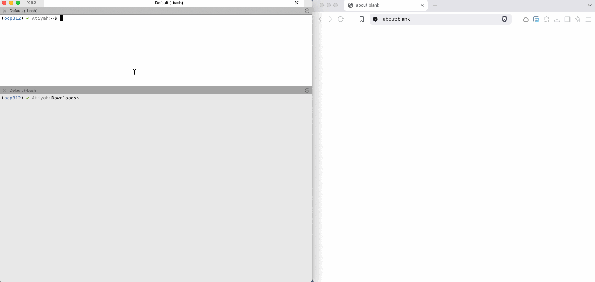

# Debug code with visual debugging

## VS Code

- Ensure `OCP: on` is shown in the status bar:

    

    Clicking on it will toggle `OCP:on` (visual debugging) and `OCP:off` (no visual debugging)

- Set breakpoints and step over the code as usual

- At any point, variables can be deselected in the tree and visual debugging will remember the setting for the following steps (e.g. to unselect some temp variables "out of scope")


## Python pdb

The code line is courtesy [discord](https://github.com/bernhard-42/vscode-ocp-cad-viewer/blob/657a0917cf88ccadfb8914c8fd2302bc1de80a45/package.json#L476C1-L477C1)

```python
def show_all_locals(self, stop, line): return stop if stop else self.default("from ocp_vscode import show_all, get_port; show_all(locals(), port=get_port(), _visual_debug=True)") 
import pdb; pdb.Pdb.postcmd = show_all_locals
```



