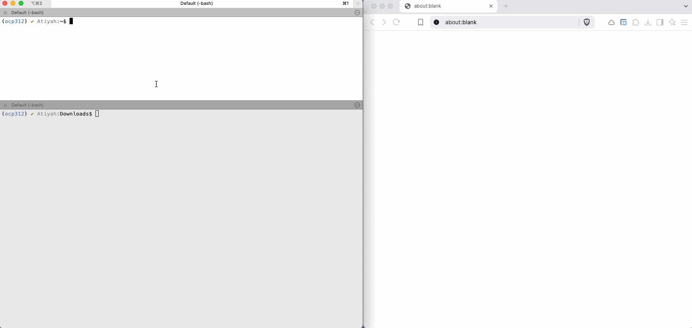

# Debug code with visual debugging

After each step, the debugger checks all variables in `locals()` for being CAD objects and displays them with their variable name.


Notes:

- Check that `OCP: <port>·DEBUG` is visible in the status bar.

    

    Clicking on it toggles between `OCP: <port>·DEBUG` (visual debugging enabled) and `OCP: <port>` (visual debugging disabled).

- Planes, locations and axes are also shown — name your contexts so they appear with meaningful labels.
- The viewer remembers camera position and which variables were unselected in the tree across steps (e.g. to hide temp variables that are out of scope).
- During debugging, `show` and `show_object` are disabled — they would interfere with the visual debugging.
- Set breakpoints and step over the code as usual.

## Python pdb

The code line is courtesy [discord](https://github.com/bernhard-42/vscode-ocp-cad-viewer/blob/657a0917cf88ccadfb8914c8fd2302bc1de80a45/package.json#L476C1-L477C1)

```python
def show_all_locals(self, stop, line): return stop if stop else self.default("from ocp_vscode import show_all, get_port; show_all(locals(), port=get_port(), _visual_debug=True)")
import pdb; pdb.Pdb.postcmd = show_all_locals
```


