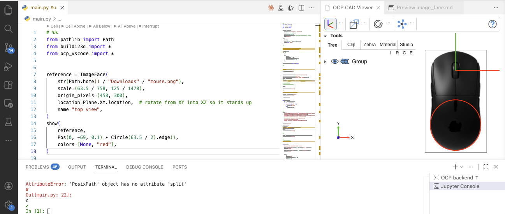

# ImageFace — use a 2-D image as a reference plane

`ImageFace` (re-exported from `ocp_tessellate.cad_objects`) renders a 2-D image as a flat face in the 3-D scene. Typical use cases:

- Trace a build123d / CadQuery model over a photo of the real object.
- Drop a technical drawing into the scene so dimensions can be compared visually.
- Show a logo or annotation on a plane.

```python
from ocp_vscode import show, ImageFace

f = ImageFace("front_view.png", scale=600 / 912, origin_pixels=(450, 600))
show(f)
```

## Signature

```python
ImageFace(image_path, scale=1.0, origin_pixels=(0, 0), location=None, name="ImageFace")
```

| Parameter       | Description                                                                                                                                                                                                                         |
| --------------- | ----------------------------------------------------------------------------------------------------------------------------------------------------------------------------------------------------------------------------------- |
| `image_path`    | Path to a PNG / JPG file.                                                                                                                                                                                                           |
| `scale`         | Float, or `(sx, sy)` tuple. Maps **pixels → model units**: `scale = real_size / pixels` along that axis. With `scale=1.0`, one pixel becomes one model unit.                                                                        |
| `origin_pixels` | Pixel coordinates `(x, y)` from the **top-left** of the image. The point at these pixel coordinates becomes the local `(0, 0)` of the face — i.e. the spot where the face touches the origin once placed at `Location((0,0,0))`.    |
| `location`      | Optional `Location` (build123d) / TopLoc_Location (cadquery / OCP) applied after the image has been placed flat in the XY plane. Use it to rotate the image onto another plane (e.g. `Plane.XZ.location`) or move it into position. |
| `name`          | Label shown in the navigation tree.                                                                                                                                                                                                 |

The face is created in the XY plane (Z = 0). The image is base64-encoded into the message that travels to the viewer, so the file does not need to remain on disk after `show`.

## Preparation workflow

Most of the work happens **before** the `ImageFace` call: turning a raw photo or drawing into something you can align numerically. The goal is to know three things:

1. The image's content is aligned to the coordinate axes you want it to span.
2. The number of model units per pixel along each axis (`scale`).
3. The pixel coordinates of the point in the image that should sit at the model origin (`origin_pixels`).

### Step 1 — Align

If you photographed the object, make sure the camera was straight-on. Rotate the image so the features you care about run horizontally / vertically. Any perspective distortion ("the further edge looks smaller") will not be correctable here — re-shoot with a longer focal length and a more orthogonal angle if needed.

For technical drawings or screenshots, this step is usually a no-op.

### Step 2 — Crop

Crop tightly to the area you want as the face. There's no value in keeping margins of empty background; they just enlarge the face and confuse `origin_pixels`.

### Step 3 — Measure scale

You need at least one known real-world dimension visible in the image. Examples:

- A printed scale bar or ruler in the photo.
- A part feature whose size you already know (the diameter of a standard bolt head, a fastener spacing from the datasheet, …).
- The overall outer dimension when the drawing's bounding extent is known.

Measure that feature in **pixels** in your image editor. Then:

```text
scale = real_world_length_in_mm / measured_length_in_pixels
```

In practice the two scales rarely come out exactly equal: pixels in screenshots and photos aren't reliably square once display scaling, image resampling, or even a slight off-angle shot enters the picture, so the same real-world length measured along x and along y typically yields slightly different mm-per-pixel ratios. Measure both axes against known real-world distances and pass a `(sx, sy)` tuple — only fall back to a single float if you genuinely have one isotropic measurement.

### Step 4 — Find the reference point

Decide what point of the image should align with the model origin (0, 0). Common choices:

- A corner of the part (works well when modeling from one corner).
- The center of a hole or a clear feature.
- The center of the image (if you don't care where the origin sits).

Read the pixel coordinates of that point — measured from the **top-left** of the image. That's your `origin_pixels` tuple.

## Example: doing the preparation in GIMP

GIMP is free on every platform and has the right tools out of the box. Steps:

1. **Open** the image with GIMP.
2. **Align** if needed: `Tools > Transform Tools > Rotate` (or `Shift+R`). Type the exact angle or use the on-canvas handle.
3. **Crop**: `Tools > Transform Tools > Crop` (or `Shift+C`), drag a rectangle, press `Enter`. Then `Image > Crop to Content` if you want it tightened to the cropped layer.
4. **Measure scale**: `Tools > Measure` (or `Shift+M`). Click the first endpoint of your known feature, then the second. The status bar at the bottom shows the distance in pixels. Divide your known real length by that pixel count.
5. **Find the reference point**: hover over the point in the image; the pixel coordinates appear in the status bar as `(x, y)` from the top-left. Note them down.
6. **Export** the result as PNG: `File > Export As…`. Keep the alpha channel if you want a transparent background.

The same workflow works in Photoshop (Ruler tool + Info panel), Affinity Photo, or macOS Preview (rectangular select shows pixel dimensions; the Color Picker dropper shows pixel coordinates).

## Plugging the values in

After the preparation you typically have something like:

```text
image:       mouse_top_view.png    (object measured 758 × 1470 px)
object:      63.5 x 125 mm
scale:       x-scale, y-scale = (63.5 / 758, 125 / 1470)
origin:      pixel (457, 300) (middle of the mouse wheel)
```

```python
from build123d import Plane
from ocp_vscode import show, ImageFace

reference = ImageFace(
    str(Path.home() / "Downloads" / "mouse_top_view.png"),
    scale=(63.5 / 758, 125 / 1470),
    origin_pixels=(458, 300),
    location=Plane.XY.location,  # use Plane.XZ.location to rotate from XY into XZ so it stands up
    name="top view",
)
show(
    reference,
    Pos(0, -69, 0.1) * Circle(63.5 / 2).edge(),
    colors=[None, "red"],
)
```

Note, it is a good idea to place a face with original mm sizes onto th image to verify everything is fine (here the circle with radius width/2)



A few things worth noting:

- The reference face lives in the XY plane by default. Use `location=Plane.XZ.location` (or `Plane.YZ.location`) to stand it up against the model.
- Pair it with `transparent=True` in `show` so the image isn't hidden by opaque geometry.
- If you want the image to sit slightly behind the model along the normal, multiply the location by a small offset: `Plane.XZ.location * Location((0, 0, -0.1))`.

## Gotchas

- **Origin convention is top-left.** Pixel `(0, 0)` is the upper-left corner of the image, not the lower-left. `ImageFace` internally flips this so y increases upward in model space — you just supply pixel coordinates as your editor shows them.
- **Image lives in the message.** The bytes are base64-encoded and sent to the viewer once. There is no live link to the file; re-call `ImageFace` and `show` to pick up edits.
- **PNG transparency works.** Keep the alpha channel if you want to see model geometry through cut-outs in the reference.
