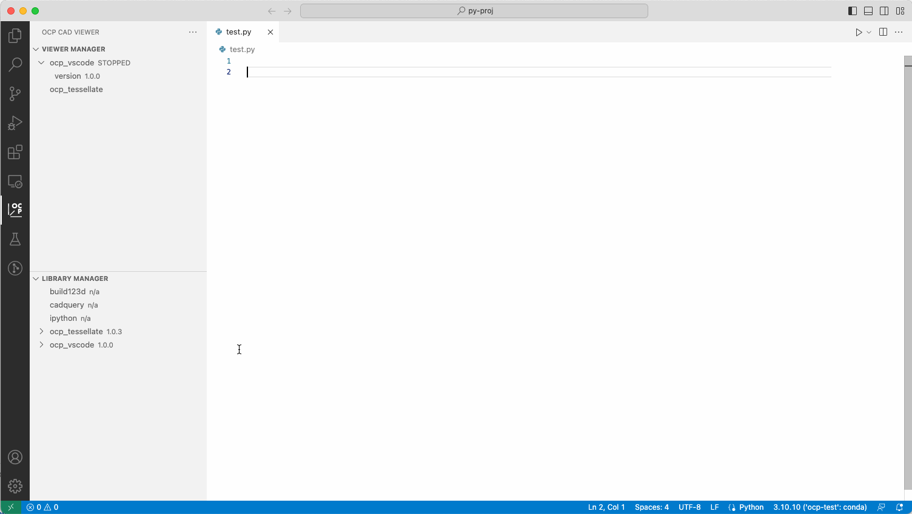

## Install Libraries

For each library available in the Library Manager, presseing the green down-arrow will install it:
1. Select between `conda`, `mamba` and `pip` for installation. For `poetry` projects, `poetry` can be used for installation.
2. Ensure that the right environment is chosen.
3. Verify that the success info message appears in VS Code.

