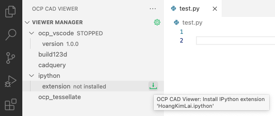
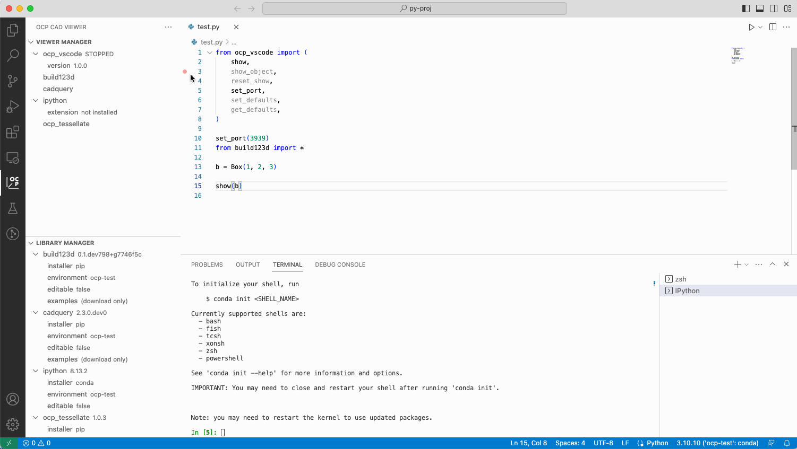

## Using with IPython extension

-   Install ipython as described above.
-   Install the IPython extension by pressing the green button behind the "ipython" entry in the "Viewer Manager"

    

-   Paste the ipython delimiters by using the paste button behing the "ipython" entry" in the "Viewer Manager" section
-   Use the green run button to run an IPython section

