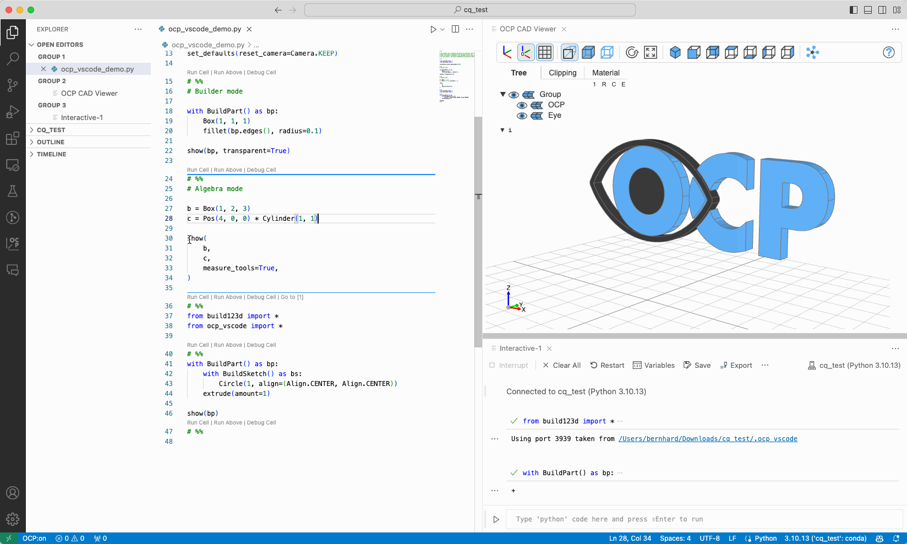
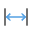
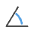

# Measure mode

Note: The parameter measure_tools is not needed any more

## Tools

There are three tools:

 **Properties**: Get the properties of the object selected.

 **Measurement**: Get the distance of the two objects selected.

 **Angle**: Get the angle between the two objects selected.

## Topology Filter

For easier selection, there is a **topology filter**

There are keybinding shortcuts for the topology filters :

- "v" : vertices
- "e" : edges
- "f" : faces
- "s" : solid
- "n" : none

## Deselect

- In any of the tools pressing "escape" will delete all the selections
- "backspace" or "mouse button right click" will delete the last selection only.
