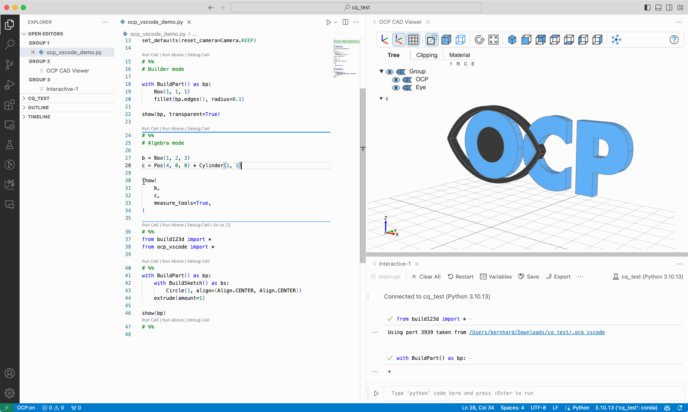
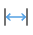
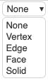

# Measure mode



## Tools

There are two tools:

 **Properties**: Get the properties of the object selected. For circles and ellipses the diameter is also reported.

 **Measurement**: Get the distance of the two objects selected and the angle between them or their normals.

## Programmatic activation

The active tool can be selected from Python with `analysis_tool=`, which is accepted by every `show*` command and by `set_viewer_config`:

```python
from ocp_vscode import show, set_viewer_config, AnalysisTool

show(part, analysis_tool=AnalysisTool.PROPERTIES)
# or, on an already-running viewer:
set_viewer_config(analysis_tool=AnalysisTool.DISTANCE)
```

Allowed values: `AnalysisTool.PROPERTIES`, `AnalysisTool.DISTANCE`, `AnalysisTool.SELECT`, `AnalysisTool.OFF`. The string equivalents `"properties"`, `"distance"`, `"select"`, `"off"` also work.

`analysis_tool` is mutually exclusive with `explode=True`.

## Topology Filter

For easier selection, there is a **topology filter**



There are keybinding shortcuts for the topology filters :

- "v" : vertices
- "e" : edges
- "f" : faces
- "s" : solid
- "n" : none

## Deselect

- In any of the tools pressing "escape" will delete all the selections
- "backspace" or "mouse button right click" will delete the last selection only.
