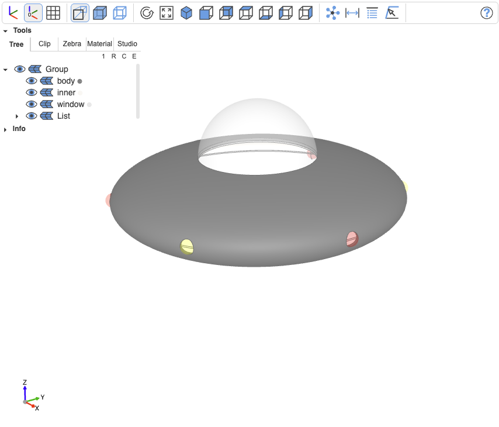
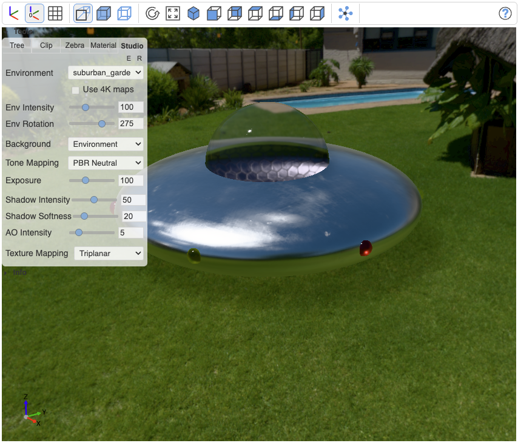
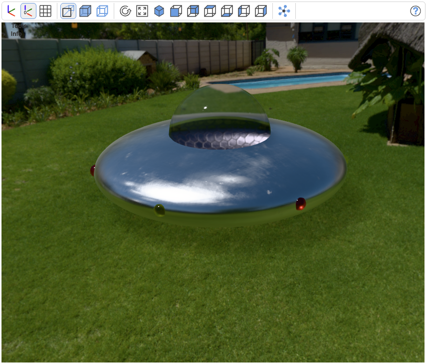
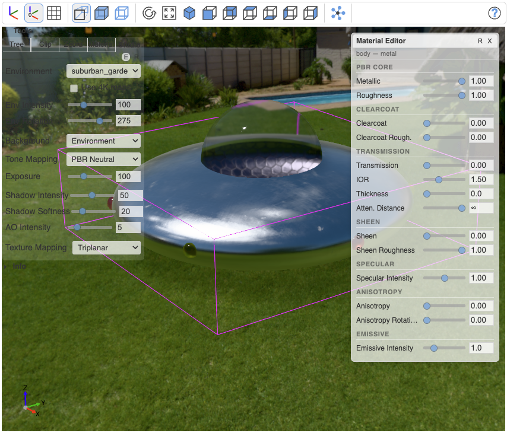

## Material setup

Materials can be defined using the class `Material` from [threejs-materials](https://github.com/bernhard-42/threejs-materials) (`[uv] pip install threejs-materials`)

- `Material.ambientcg`: https://ambientcg.com/list?type=material
- `Material.gpuopen`: https://matlib.gpuopen.com/main/materials/all
- `Material.polyhaven`: https://polyhaven.com/textures
- `Material.physicallybased`: https://physicallybased.info/

Materials allow to load, override PBR parameters, and scale textures (if the material comes with a texture):

```python
from threejs_materials import Material

# Use a GPUOpen material
alu_hex = Material.gpuopen.load("Aluminum Hexagon")

# Use a GPUOpen material and override the glass behavior
glass = Material.gpuopen.load("Glass").override(transmission=0.98, thickness=0.8)

# Use an AmbientCG material, and scale the texture to 2 in u and v direction
metal = Material.ambientcg.load("Metal 049 C").scale(2, 2)

# Use a PhysicallyBased material and override color for two material instances
light = Material.physicallybased.load("Plastic (Acrylic)")
red_light = light.override(color=(1, 0, 0))
yellow_light = light.override(color="yellow")

```

## The object

Let's create a little object to apply the materials later (here with [build123d](https://github.com/gumyr/build123d) algebra mode)

```python
from build123d import _
from ocp_vscode import _

mcc = (Align.MIN, Align.CENTER, Align.CENTER)
ccm = (Align.CENTER, Align.CENTER, Align.MIN)
ccM = (Align.CENTER, Align.CENTER, Align.MAX)

e = Ellipse(10, 3)
e2 = offset(e, -0.2)
e -= e2
e -= Rectangle(12, 6, align=mcc)

e3 = offset(e2, -0.1)
e2 -= e3
e2 -= Rectangle(12, 6, align=mcc)

body = Rot(90, 0, 0) _ revolve(e, Axis.Y)
inner = Rot(90, 0, 0) _ revolve(e2, Axis.Y)
mask = Cylinder(4, 3, align=ccm)
body = body - mask
inner = inner - mask

window = Pos(0, 0, 2.55) _ (Rot(0, 90, 0) _ (Sphere(4) - Sphere(3.98)) - Box(10, 10, 10, align=ccM))
lights = [loc * Rot(0, 0, 180) * Sphere(0.5) for loc in PolarLocations(9.8, 6)]
body -= lights

body.label = "body"
inner.label = "inner"
window.label = "window"
for i, l in enumerate(lights):
    l.label = f"light\_{i}"

```

## Assigning materials and interpolating colors for CAD view

Material objects are assigned directly to the `.material` attribute of CAD objects. Use `.interpolate_color()` to derive a representative color for the CAD view.

```python
body.material = metal
body.color = "grey"

inner.material = alu_hex
inner.color = metal.interpolate_color()

window.material = glass
window.color = glass.interpolate_color()

for i, l in enumerate(lights):
    l.material = red_light if i % 2 == 0 else yellow_light
    l.color = l.material.interpolate_color()
```

## Visualisation

Show and use a custom environment map in the Studio tab, rotated by 180°

```python
show(
    body,
    inner,
    window,
    lights,
    studio_environment="https://dl.polyhaven.org/file/ph-assets/HDRIs/hdr/4k/suburban_garden_4k.hdr",
    studio_env_rotation=275,
)
```



### PBR view

Switch to Studio mode:

```python
set_viewer_config(tab="studio")
```



### No tools mode

Tools can now be hidden by clicing on the **> Tools** button above the tools



### Material Editor

Doble click an object to select it and press the little "E" button.



Changes are marked red, you can apply the as `overrides` in your Python code

## Full code

The complete demo can be found [here](../examples/pbr-studio-demo.py)
