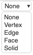

# Measure mode

## Tool

 Click on faces, edges, or vertices to select their indices. Do not mix vertices, edges and faces and apply it to just one solid, compound, face or line.

## Topology Filter

For easier selection, there is a **topology filter**

There are keybinding shortcuts for the topology filters :

- "v" : vertices
- "e" : edges
- "f" : faces
- "s" : solid
- "n" : none

## Python functions

- `select_vertices(obj, indices)`
    
    Similar to `obj.vertices()` returns a `ShapeList` of vertices associated with the `indices` given as list, e.g. `[1,3,6]`

- `select_edges(obj, indices)`
    
    Similar to `obj.edges()` returns a `ShapeList` of edges associated with the `indices` given as list, e.g. `[1,3,6]`

- `select_faces(obj, indices)`
    
    Similar to `obj.faces()` returns a `ShapeList` of faces associated with the `indices` given as list, e.g. `[1,3,6]`

## Deselect

- In any of the tools pressing "escape" will delete all the selections
- "backspace" or "mouse button right click" will delete the last selection only.
