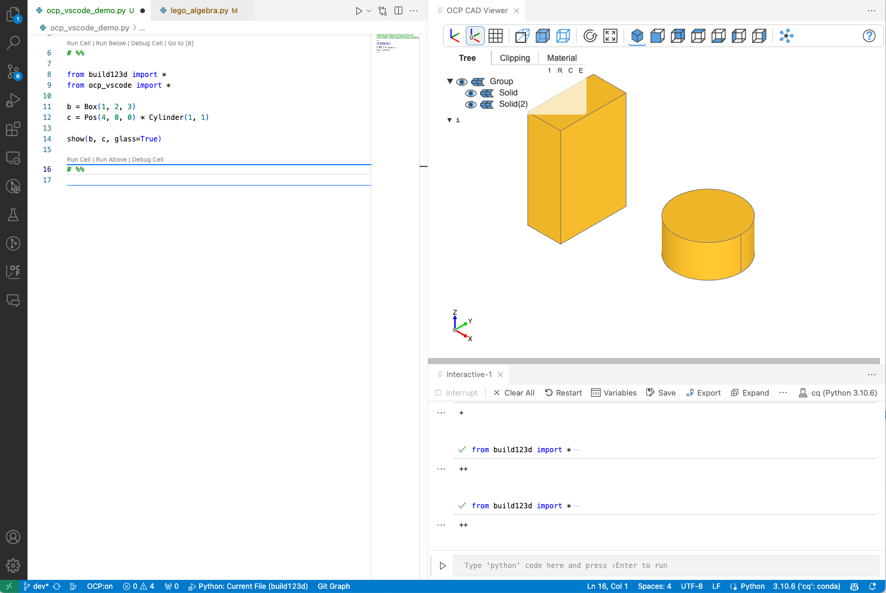
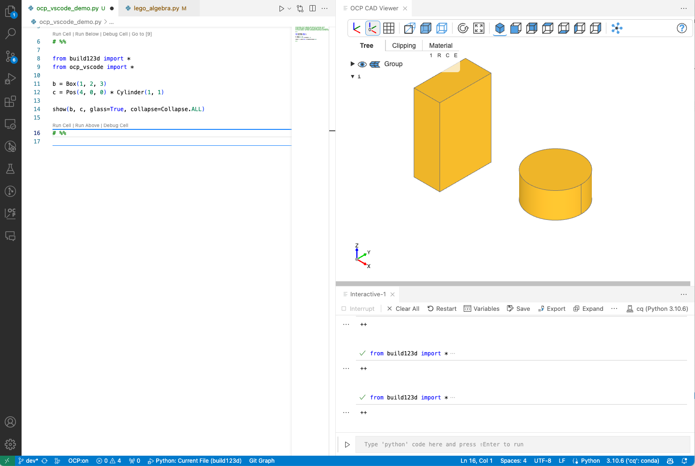
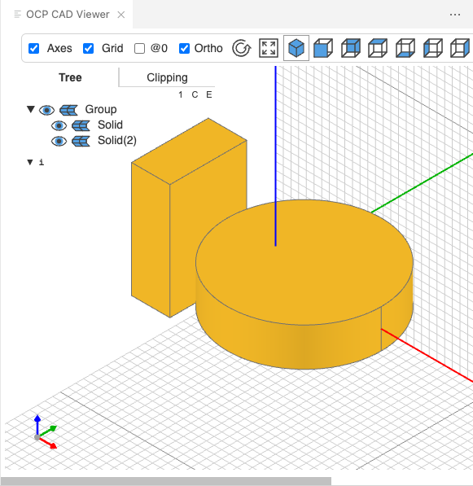
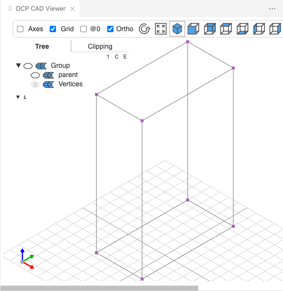
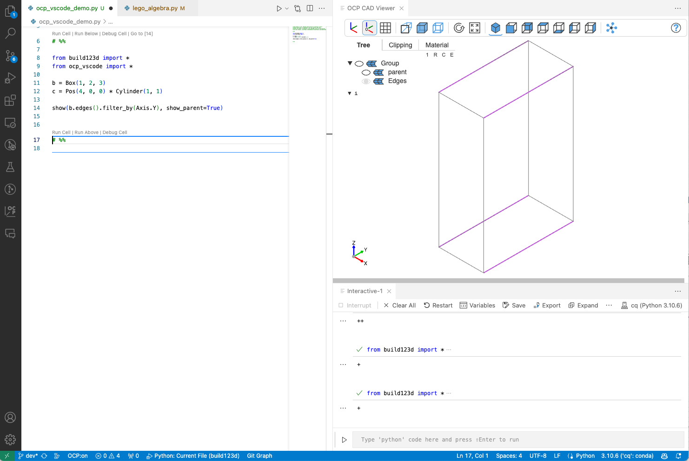

## show

### Command

The show command is used to show one or multiple CAD objects and comes with the following parameters:

```python
show(*cad_objs, <keyword arguments>)
```

### Arguments

```text
Parameters
    cad_objs:                All cad objects that should be shown as positional parameters

Keywords for show:
    names:                   List of names for the cad_objs. Needs to have the same length as cad_objs
    colors:                  List of colors for the cad_objs. Needs to have the same length as cad_objs
    alphas:                  List of alpha values for the cad_objs. Needs to have the same length as cad_objs
    port:                    The port the viewer listens to. Typically use 'set_port(port)' instead
    progress:                Show progress of tessellation with None is no progress indicator. (default="-+c")
                             for object: "-": is reference, "+": gets tessellated, "c": from cache

Valid keywords to configure the viewer:
- UI
    glass:                   Use glass mode where tree is an overlay over the cad object (default=False)
    tools:                   Show tools (default=True)
    tree_width:              Width of the object tree (default=240)

- Viewer
    axes:                    Show axes (default=False)
    axes0:                   Show axes at (0,0,0) (default=False)
    grid:                    Show grid (default=False)
    ortho:                   Use orthographic projections (default=True)
    transparent:             Show objects transparent (default=False)
    default_opacity:         Opacity value for transparent objects (default=0.5)
    black_edges:             Show edges in black color (default=False)
    orbit_control:           Mouse control use "orbit" control instead of "trackball" control (default=False)
    collapse:                1: collapse all leaf nodes, C: collapse all nodes, E: expand all nodes (default=1)
    ticks:                   Hint for the number of ticks in both directions (default=10)
    up:                      Use z-axis ('Z') or y-axis ('Y') as up direction for the camera (default="Z")
    explode:                 Turn on explode mode (default=False)

    zoom:                    Zoom factor of view (default=1.0)
    position:                Camera position
    quaternion:              Camera orientation as quaternion
    target:                  Camera look at target
    reset_camera:            Reset camera position, rotation and zoom to default (default=True)

    pan_speed:               Speed of mouse panning (default=1)
    rotate_speed:            Speed of mouse rotate (default=1)
    zoom_speed:              Speed of mouse zoom (default=1)

- Renderer
    deviation:               Shapes: Deviation from linear deflection value (default=0.1)
    angular_tolerance:       Shapes: Angular deflection in radians for tessellation (default=0.2)
    edge_accuracy:           Edges: Precision of edge discretization (default: mesh quality / 100)

    default_color:           Default mesh color (default=(232, 176, 36))
    default_edgecolor:       Default color of the edges of a mesh (default=#707070)
    default_facecolor:       Default color of the edges of a mesh (default=#ee82ee)
    default_thickedgecolor:  Default color of the edges of a mesh (default=#ba55d3)
    default_vertexcolor:     Default color of the edges of a mesh (default=#ba55d3)
    ambient_intensity:       Intensity of ambient light (default=1.00)
    direct_intensity:        Intensity of direct light (default=1.10)
    metalness:               Metalness property of the default material (default=0.30)
    roughness:               Roughness property of the default material (default=0.65)


    render_edges:            Render edges  (default=True)
    render_normals:          Render normals (default=False)
    render_mates:            Render mates for MAssemblies (default=False)
    render_joints:           Render build123d joints (default=False)
    parallel:                Tessellate objects in parallel (default=False)
    show_parent:             Render parent of faces, edges or vertices as wireframe
    helper_scale:            Scale of rendered helpers (locations, axis, mates for MAssemblies) (default=1)

- Debug
    debug:                   Show debug statements to the VS Code browser console (default=False)
    timeit:                  Show timing information from level 0-3 (default=False)
```

### Typically useful parameters

-   Provide maximum space for the CAD object with _glass_ mode

    `show(b, c, glass=False)`

    

-   Hide the tree in glass mode by collapsing the it

    `show(b, c, glass=True, collapse="C")`

    

    Other valid parameters are "1" (collapse leafs) and "E" (explode tree)

-   Names, colors and alpha values

    `show(b, c, colors=["red", "green"], names=["red box", "green cylinder"], alphas=[1.0, 0.2])`

    

-   Axes and grids

    `show(b, c, axes=True, axes0=False, grid=(True, True, False), ticks=40)`

    

-   Keeping the camera position between `show` commands

    `show(b, c, reset_camera=False)`

-   Show parent object for edges, faces and vertices (build123d syntax)

    `show(b.vertices(), show_parent=True)`

    

    `show(b.edges().filter_by(Axis.Y), show_parent=True)`

    

    `show(b.faces().filter_by(Axis.Y), show_parent=True)`

    
