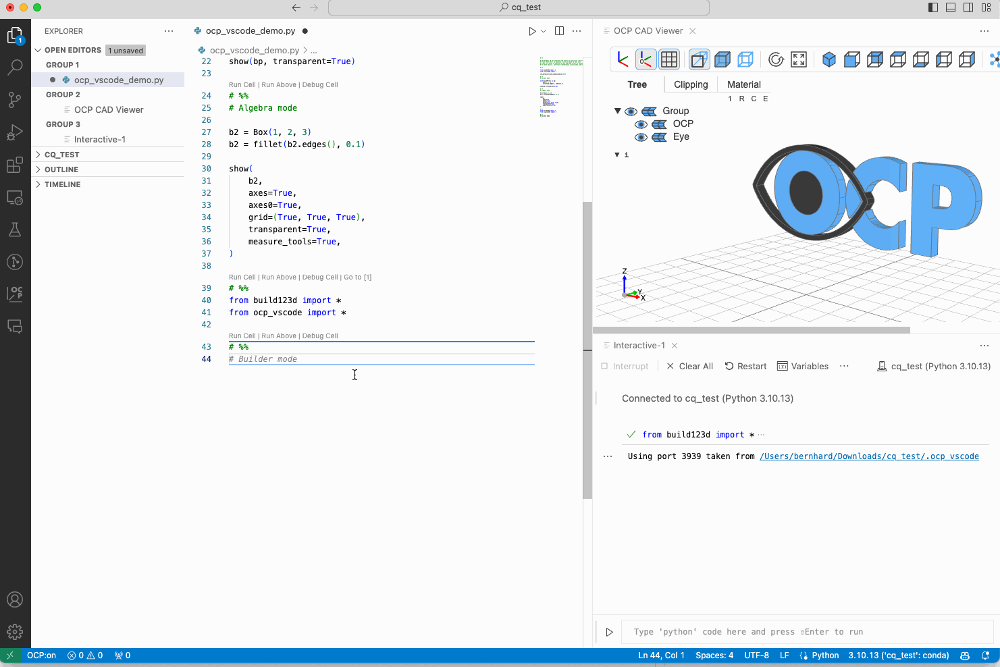

## (Experimental) Install build123d snippets

_OCP CAD Viewer for VS Code_ allows to install a _code-snippets_ file for build123d:

-   Use `Ctrl-Shift-P / Cmd-Shift-P` and select _OCP CAD Viewer: Install CAD snippets into <project>/.vscode/_
-   After typing `bd_` a list of snippets appears that guide the user through creation of some basic build123d patterns

