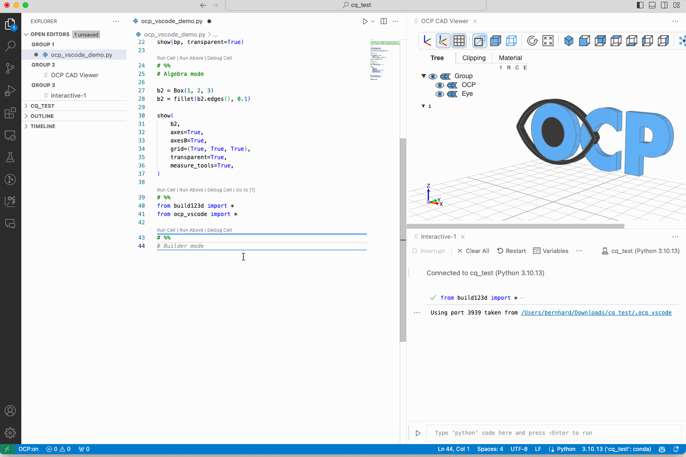

## (Experimental) Install build123d snippets

_OCP CAD Viewer for VS Code_ allows to install a _code-snippets_ file for build123d:

-   Use `Ctrl-Shift-P / Cmd-Shift-P` and select _OCP CAD Viewer: Install CAD snippets into <project>/.vscode/_
-   After typing `bd_` a list of snippets appears that guide the user through creation of some basic build123d patterns

### Customizing the snippets

The snippet bodies that get written into `<project>/.vscode/` come from the `OcpCadViewer.snippets.dotVscodeSnippets` setting. The default ships a set of build123d patterns (prefixes `bd_p`, `bd_s`, `bd_l`, …); override the setting in your user or workspace settings to add your own or change the existing ones. The structure mirrors a standard VS Code `.code-snippets` JSON file, grouped by library name at the top level.