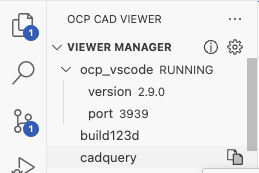

# Model viewing

## RuntimeError: Cannot access viewer config. Is the viewer running?

The additional warning at the top of the stacktrace says:
    
```{ .text .no-copy }
UserWarning: The viewer doesn't seem to run: Port could not be cast to integer value as 'None'
```

- Is the viewer running?
    
    **⇒** Restart viewer

- Check `~/.ocpvscode`. 

    For example, if two OCP CAD Viewer instances are running, it should look like:

    ```{ .json .no-copy }
    {
      "version": 2,
      "services": {
        "3939": "",
        "3940": ""
      }
    }
    ```

    **⇒** To reset it, change it to `{}`. It will be rebuilt when you restart the OCP CAD Viewer instance.

## UserWarning: The viewer doesn't seem to run: [Errno 61] Connection refused

Are you using the right port? Check in the Viewer Manager of OCP CAD Viewer, which port the viewer is running. 

 

If you use the standalone version, check the output.

```bash
❯ python -m ocp_vscode

The viewer is running on http://127.0.0.1:3939/viewer # (1)

 * Serving Flask app 'ocp_vscode.standalone'
 * Debug mode: off
 ...
```

1. The viewer URL with the port, here 3939

**⇒** Given this port, e.g. 3939, use `show(objects, port=3939)`. The viewer should now show the objects. If not, restart the viewer. In VS Code, close the viewer tab (it will clean up behind it) and start the viewer again. In standalone mode, Ctrl-C stop the viewer and restart again.

## CAD Models are almost always invisible in the OCP viewer window

```{ .text .no-copy }
three-cad-viewer.esm.js:20276 THREE.WebGLProgram: Shader Error 0 - VALIDATE_STATUS false

Material Name:
Material Type: LineBasicMaterial

Program Info Log: Program binary could not be loaded. Binary is not compatible with current driver/hardware combination. Driver build date Mar 19 2024. Please check build information of source that generated the binary.
Location of variable pc_fragColor conflicts with another variable.
```

VS Code internal browser that renders the viewer component uses a cache for code and other artifacts. This includes WebGL artifacts like compiled shaders. It can happen that e.g. due to a graphic driver update the compiled version in the cache does not fit to the new driver. Then this error message appears.

**⇒**  [Delete the VS Code browser cache on Linux](https://bobbyhadz.com/blog/vscode-clear-cache) (go to the section for your operating system)


## Configuration unexpected in the VS Code logo screen

Do not use the _OCP CAD Viewer_ logo to verify your _OCP CAD Viewer_ settings. The logo overwrites all your settings in VS Code with its own settings to always look the same on each instance. 

**⇒**  Use a simple own model for checking your configuration.
